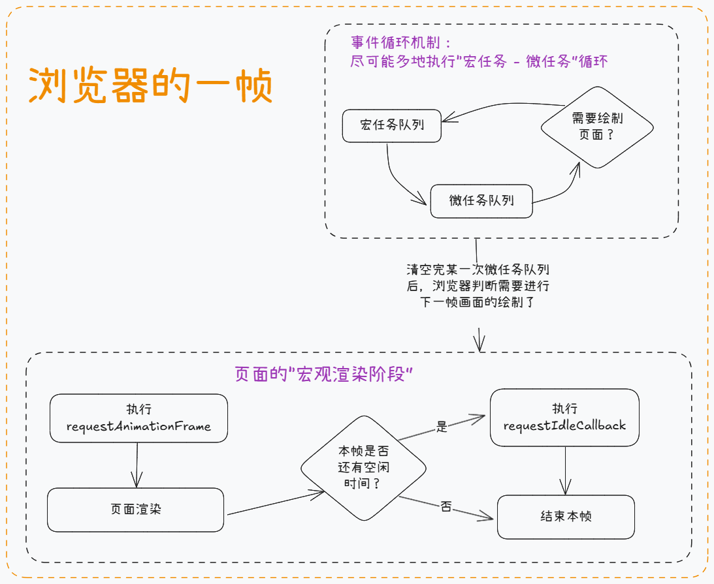

# 前言

众所周知，JS 在主线程上是单线程执行的，并通过事件循环（Event Loop）机制来实现异步操作的处理。

本文将梳理事件循环机制的执行流程，并尝试模拟其中对任务队列的处理机制。

# 事件循环

JS 在设计之初的目的是用于操作 DOM，为了避免多个线程同时操作 DOM 引发冲突，所以 JS 就被设计为单线程。

而在单线程环境中，想要处理异步操作，JS 使用的是事件循环机制。

事件循环机制将异步操作分为两大类，分别是`宏任务` 和 `微任务`，任务队列则`宏任务队列` 和 `微任务队列`的统称。

宏任务与微任务的具体分类如下：

- 宏任务：script 标签、setTimeout、setInterval、UI 交互事件
- 微任务：Promise、MutationObserver

事件循环机制的执行流程如下：

1. 执行主任务（遇到宏任务时，将其加入宏任务队列的队尾。微任务同理。）。
2. 执行微任务：按顺序清空微任务队列（处理宏任务、微任务的逻辑与第一步相同）。
3. 判断是否需要渲染页面（由浏览器自动判断）。
4. 执行宏任务：取出宏任务队列的第一个任务，执行之（处理宏任务、微任务的逻辑与第一步相同）。
5. 重复循环第二、第三、第四步，直至任务队列为空。

示意图：


如上图所示，“宏任务 - 微任务 - 判断是否需要渲染页面”这种循环执行的机制就称为事件循环机制。

# 拓展：页面帧与事件循环
只谈论事件循环机制似乎有点抽象，因为目前来说它有点“看不清摸不着”，不知道它处于整个web应用中的“哪个部分”。而我们看结合 `页面帧` 的概念，用更具象的方式去理解事件循环机制。

所谓的“帧”可理解为“周期”，举个例子：如果当前页面每秒刷新 60 次，那么它的刷新率就是 60hz，即每秒 60 个周期/帧。也就是说（刷新率为 60hz 时）每帧的时间为 1s / 60 = 16.6ms。

每一帧是一个周期循环，浏览器需要在每一帧中执行重复的任务，以保持页面能正常展示与使用。

具体来说，浏览器每一帧需要做的事可按执行顺序归纳为：

1. 运行事件循环机制（尽可能多地执行宏任务与微任务）
2. 执行(requestAnimationFrame)[https://developer.mozilla.org/zh-CN/docs/Web/API/Window/requestAnimationFrame]
3. 页面渲染
4. （如有空闲时间）执行(requestIdleCallback)[https://developer.mozilla.org/zh-CN/docs/Web/API/Window/requestIdleCallback]

示意图：


可以发现，页面每一帧的第一件事就是运行事件循环机制，它并非是一个抽象的机制，而是切实地发生在每一个 16.6 毫秒中。希望结合页面帧，能让大家对事件循环机制有更具象的理解。

# 模拟事件循环机制
接下来我们将尝试编写代码模拟事件循环中对任务队列的处理机制。

## 目标

> 模仿浏览器事件循环机制，实现：
>
> 1. 执行主任务。
> 2. 清空微任务队列。
> 3. 取出第一个宏任务并执行。
> 4. 循环第二、第三步，直至任务队列为空。

为了使整个模拟逻辑能走通，现使用自定义的 `pushMacro` 和 `pushMicro` 方法分别代表宏任务和微任务，使用方式如下所示：

```javascript
// 模拟宏任务
pushMacro(() => {
  console.log("hello");
});
// 类比原生宏任务setTimeout
setTimeout(() => {
  console.log("hello");
});

// 模拟微任务
pushMicro(() => {
  console.log("hello");
});
// 类比原生微任务then函数
Promise.resolve().then(() => {
  console.log("hello");
});
```

## 任务

具体编码任务为：

1. 完善 pushMacro 和 pushMicro 方法，维护宏任务队列和微任务队列。
2. 编写 worker 函数，接收主任务 main 函数作为参数。其功能为模拟 JS 主线程执行主任务 mian 函数，并使事件循环机制能正常执行。

需求代码如下所示：

```javascript
// 添加微任务（需完善）
function pushMicro() {}
// 添加宏任务（需完善）
function pushMacro() {}
// 模拟JS主线程（需完善）
function worker() {}

// 主任务
const main = () => {
  console.log("a");
  pushMicro(() => {
    console.log("b");
    pushMicro(() => {
      console.log("c");
    });
    pushMacro(() => {
      console.log("d");
    });
  });
  pushMacro(() => {
    console.log("e");
  });
  console.log("f");
};

worker(main); // 运行后输出：a, f, b, c, e, d
```

## 具体实现

## 维护任务队列
首先我们需要模拟出宏任务队列和微任务队列，但正因为它们是队列，所以我们直接使用数组就可以简单模拟它们的特性了。

其次是如何添加宏任务和微任务，参考setTimeout和Promise的then函数，可以发现它们都是接受一个函数作为参数，然后在适当的时机再调用。\
那么我们的pushMicro和pushMacro也同样接收回调函数作为参数，并将它们添加到对应的队列中。这样就完成了任务队列的维护了。

具体代码如下所示：
```javascript
//微任务队列
const microQueue = [];
// 宏任务队列
const macroQueue = [];

// 添加微任务
function pushMicro(fn) {
  microQueue.push(fn);
}
// 添加宏任务
function pushMacro(fn) {
  macroQueue.push(fn);
}
```

## 处理任务队列
接下来需要编写worker函数去模拟JS主线程，完成以下两个任务：
1. 执行主任务main函数
2. 在合适的时机以合适的方式处理宏任务和微任务

其中执行main函数这点并没有什么特殊，就是接受一个回调函数并执行它而已。

而对于任务队列的处理上，我们需要编写一个handleQueue函数，递归调用自身，以实现循环处理的效果。\
需要注意的点是，在清空微任务队列时，如果某个微任务中又添加了微任务，那么新添加的微任务会排在队尾，并且`会在同一轮中执行`。

具体代码如下所示：
```javascript
function worker(callback) {
  // 处理任务队列
  function handleQueue() {
    // 处理微任务
    while (microQueue.length) {
      // 清空微任务队列
      const fn = microQueue.shift();
      fn();
    }

    // 处理宏任务
    if (macroQueue.length) {
      // 执行宏任务队列的第一个任务
      const fn = macroQueue.shift();
      fn();
    }

    // 如任务队列中还有任务，则递归循环处理
    if (microQueue.length || macroQueue.length) handleQueue();
  }

  callback();
  handleQueue();
}
```
上述代码需要注意的是，清空微任务队列时使用了while循环，每次都重新读取微任务队列的长度。而不能直接使用forEach等数组遍历方法，因为这些方法的遍历次数在刚开始时已经确定了，如果在清空微任务的过程中有新的微任务加入，则它们就不会在本轮被执行。

## 完整代码

```javascript
//微任务队列
const microQueue = [];
// 宏任务队列
const macroQueue = [];

// 添加微任务
function pushMicro(fn) {
  microQueue.push(fn);
}
// 添加宏任务
function pushMacro(fn) {
  macroQueue.push(fn);
}

function worker(callback) {
  // 处理任务队列
  function handleQueue() {
    // 处理微任务
    while (microQueue.length) {
      // 清空微任务队列
      const fn = microQueue.shift();
      fn();
    }

    // 处理宏任务
    if (macroQueue.length) {
      // 执行宏任务队列的第一个任务
      const fn = macroQueue.shift();
      fn();
    }

    // 如任务队列中还有任务，则递归循环处理
    if (microQueue.length || macroQueue.length) handleQueue();
  }

  callback();
  handleQueue();
}

// 主任务
const main = () => {
  console.log("a");
  pushMicro(() => {
    console.log("b");
    // 微任务中添加了新的微任务，也会在同一轮的事件循环中一起被清空
    pushMicro(() => {
      console.log("c");
    });
    pushMacro(() => {
      console.log("d");
    });
  });
  pushMacro(() => {
    console.log("e");
  });
  console.log("f");
};

worker(main); // 输出：a, f, b, c, e, d
```

# 总结
文本主要归纳了事件循环机制的作用及其流程。结合页面帧的概念，在更高层面上具象化地展示了事件循环机制的运行。并尝试编写函数模拟JS主线程对事件循环机制的处理。
