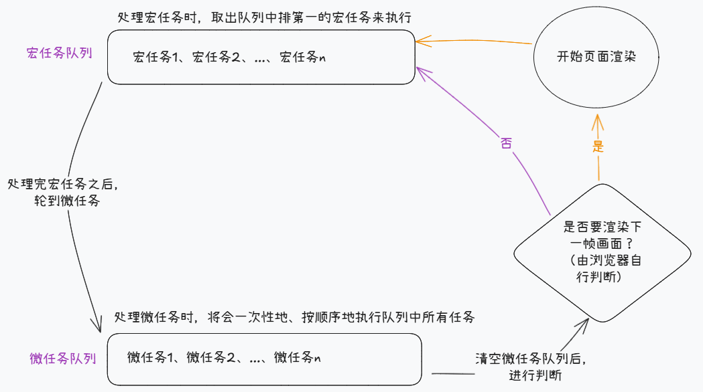

# 大纲
1. 引出事件循环，明确中心思想
2. 解释事件循环机制，
3. 模拟事件循环（）

# 前言

众所周知，JS在主线程上单线程执行，并通过事件循环（Event Loop）机制来实现异步操作的处理。

本文将梳理事件循环机制的执行流程，并尝试模拟其中对事件队列的处理机制。

# 事件循环

JS在设计之初的目的是用于操作DOM，为了避免多个线程同时操作DOM引发冲突，所以JS就被设计为单线程。

而在单线程环境中，想要处理异步操作，JS使用的则是事件循环机制。


事件循环机制有两个重点概念：
1. 调用栈
2. 任务队列

调用栈是JS主线程用于跟踪当前正在执行的函数的状态的方式。当函数被调用时，会被压入栈，执行完毕则弹出栈。

任务队列则由`宏任务队列` 和 `微任务队列`组成，


事件循环机制将异步操作分为两大类，`宏任务` 和 `微任务`:
- 宏任务：setTimeout、setInterval、I/O、UI交互事件
- 微任务：Promise、MutationObserver

事件循环机制的执行流程如下：
1. 执行主任务（遇到宏任务时，将其加入宏任务队列的队尾。微任务同理。）
2. 执行微任务：按顺序清空微任务队列
3. 执行宏任务：取出宏任务队列的第一个任务，执行之。


示意图：


# 任务

题目：**实现浏览器任务队列机制**

> 模仿浏览器任务队列机制，实现：
>
> 1. 执行主任务
> 2. 主任务执行完成后，判断是否有微任务，有则执行，直至微任务队列为空
> 3. 判断是否有宏任务，有则取出第一个，重新进行上述循环，直至宏任务队列为空。

使用如下方式模拟宏任务和微任务：

```javascript
// ========宏任务=========
// 宏任务
pushMacro(() => {
  console.log("hello");
});
// 类比原生宏任务setTimeout
setTimeout(() => {
  console.log("hello");
});

// ========微任务=============
// 微任务
pushMicro(() => {
  console.log("hello");
});
// 类似原生微任务then函数
Promise.resolve().then(() => {
  console.log("hello");
});
```

具体效果如下所示：

```javascript
// 添加微任务（待完善）
const pushMicro = (fn) => {};
// 添加宏任务（待完善）
const pushMacro = (fn) => {};

// 主任务，运行后输出：a, f, b, c, e, d
const main = () => {
  console.log("a");
  pushMicro(() => {
    console.log("b");
    pushMicro(() => {
      console.log("c");
    });
    pushMacro(() => {
      console.log("d");
    });
  });
  pushMacro(() => {
    console.log("e");
  });
  console.log("f");
};
```

> 需求：
>
> 1. 完善 pushMicro 和 pushMacro 函数，维护任务队列。
> 2. 编写 worker 函数，接收主任务 main 函数作为参数。使主任务函数能正常运行，并正确模拟浏览器的任务队列运行机制。

# 实现

```javascript
//微任务队列
const microQueue = [];
// 宏任务队列
const macroQueue = [];

// 添加微任务
const pushMicro = (fn) => microQueue.push(fn);
// 添加宏任务
const pushMacro = (fn) => macroQueue.push(fn);

// 主任务
const main = () => {
  console.log("a");
  pushMicro(() => {
    console.log("b");
    // 微任务中添加了新的微任务，也会在同一轮的事件循环中一起被清空
    pushMicro(() => {
      console.log("c");
    });
    pushMacro(() => {
      console.log("d");
    });
  });
  pushMacro(() => {
    console.log("e");
  });
  console.log("f");
};

function worker(callback) {
  // 处理任务队列（宏任务 + 微任务）
  function handleQueue() {
    // 清空微任务队列
    while (microQueue.length) {
      const fn = microQueue.shift();
      fn();
    }

    // 执行宏任务队列的第一个任务
    if (macroQueue.length) {
      const fn = macroQueue.shift();
      fn();
    }

    // 重新清空微任务队列，并执行一个宏任务
    if (microQueue.length || macroQueue.length) handleQueue();
  }

  callback();
  handleQueue();
}

worker(main); // 输出：a, f, b, c, e, d
```

# 疑惑
1. 讲解事件循环的时候，需要提到调用栈吗

