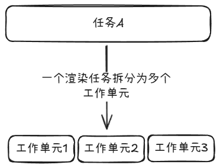
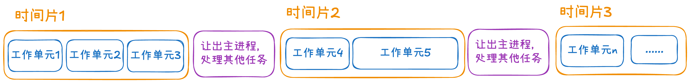

# 并发 & 并行

在计算机科学中，并发和并行是两个专业的术语，描述了两种对任务的不同处理方案。

并发：单个处理器通过时间片轮转的方式，实现多个任务交替执行，由于每个时间片很短，看起来多个任务像是同时执行。
并行：多个处理器同时执行不同任务。

以生活中的例子举例，假设有一家服装店：

- 并发就像店里只有一名工作人员，他轮转地为顾客介绍商品、收款、打包货物。
- 并行则像店里有多名工作人员，分别负责介绍商品、收款、打包货物。

> 总结：并发的特点在于及时响应，并行则在于同时处理。

# 并发特性概述

React 的并发特性（Concurrent Features）是一种渲染策略，旨在提升应用的响应能力。它允许 React 在执行渲染任务时根据优先级中断当前工作，优先处理高优先级的任务（如点击、输入），之后再恢复低优先级的渲染任务。

在 API 层面的体现：使用 createRoot 开启并发渲染机制，使用 useDeferredValue、startTransition 等 API 显式控制更新的优先级。
在底层的体现：渲染任务的可中断与恢复。

React 之所以能拥有并发能力，底层依靠以下三个概念：

- Fiber 架构 —— 底层架构
  - 需要实现并发能力，重点是可中断/恢复的渲染。Fiber 架构为可中断渲染提供了底层数据结构的支持。将整个更新任务拆分为多个工作单元，每个 Fiber 节点代表一个工作单元。从数据结构上让可中断渲染成为可能。
- Scheduler —— 架构驱动
  - Fiber 架构为可中断渲染提供了数据结构上的支持，同时也需要一个新的调度方式与之匹配，去控制渲染过程（否则还是使用旧的同步运行方式，Fiber 架构将无法发挥能力）
  - 借助时间切片，控制任务的执行时间，防止长期占用主线程（todo：根据其他文章在补充）。Scheduler 则提供了此能力。
- lanes 模型 —— 任务优先级策略
  - 不同的任务分为不同的优先级。高优先级任务可以打断低优先级任务，以实现重要任务的及时响应。lanes 模型为不同任务赋予不同优先级，配合时间切片实现高优先级任务打断低优先级任务的功能。

接下来将介绍上述三者是如何配合实现`高优先级任务打断低优先级任务`这一并发渲染需要具备的底层能力的。

基于 Fiber 架构，将渲染任务拆分为多个工作单元（为可中断渲染提供数据结构层面的支持），时间切片，释放主线程，任务调度，根据优先级执行任务

# React双工作循环
在React中，由于状态的变更（如setState的调用）所导致页面的重新渲染可以看作是一个任务（渲染任务）。而这个任务是由多个工作单元所构成的，任务的执行过程实际就是工作单元按顺序执行的过程，当所有工作单元执行完毕，则称此任务完成。

而React应用中可能同时存在多个任务，这些任务需要按照一定顺序执行，而因为JS是单线程语言，主线程在执行上述任务的过程中，无法响应如用户交互等事件，造成应用卡顿的现象。

为了使任务执行和响应事件之间取得平衡，React需要设计一个调度方案。可以从宏观上理解为：React保存了一个任务队列，队列中的任务会按某种顺序提取出来执行，并且没执行完一个任务后，React会检查这一轮从任务开始执行到此刻，是否超过了5ms，如没超过则取出下一个任务执行（此任务执行完毕后再次进行检测）；如果超过了5ms，则将下一次任务调度放到宏任务队列中，从而让出主线程去处理其他事件。此机制就是React的任务调度循环。

细心的同学可能发现了，上述任务调度循环中提到“完成某个任务后，会检测本轮任务调度所花费的时间”，那么如果有一个非常庞大的任务，它的执行时间远超5ms，那么如果React也需等待它执行完毕后才能进行判断，从而让出主线程，那么此任务的执行过程整个React应用也是出于一个长时间的阻塞。\
上述提到的隐患的确是存在的，为了避免单个任务执行时间过长，从而阻塞主线程，React除了上述提到的任务调度循环，还设计了另一个循环机制加以辅助——fiber构建循环。

所谓的“fiber”我们暂且将其理解为上述任务中的工作单元即可。即fiber节点等同于工作单元，多个工作单元组成了一个渲染任务。\
而fiber构建循环则是建立于fiber架构之上的。

渲染任务执行的过程，其实就是工作单元的执行过程，在此过程中，React也会对工作单元的执行过程进行检测，每当一个工作单元执行完毕，也会判断任务开始到此刻是否超过了5ms，如果没超过则取出下一个工作单元进行执行；如超过，则中断任务，让出主线程。（当主线程处理完其他事件后，任务调度循环会取出本次应该执行的任务，如果此任务时此前中断的任务，则可以会有中断处继续执行，无需从头执行）。


# Fiber 架构

Fiber 架构在之前的文章中有聊到，本文只简单提及其核心作用。

在 Fiber 架构被创造出来之前，React 的渲染任务是一整个任务，一旦开始执行便不可暂停与恢复。

为了使 React 应用能更好地响应紧急任务，需要设计渲染任务可暂停与恢复的渲染架构。于是 Fiber 架构就被创造出来了，为 React 的可中断渲染提供数据结构上的支持。

每个 Fiber 节点代表一个组件节点或原生元素节点，同时也代表渲染任务中的一个工作单元。依靠 child、sibling、return 节点形成链式树状结构，从结构上支持遍历的中断与恢复（知道自己从哪里来，该往哪里去）。

在执行渲染任务的过程中，当有高优先级的任务被触发时，可以以工作单元（Fiber 节点）为粒度暂停渲染，转而去处理高优先级任务，处理完毕后再回来恢复渲染任务。（此过程的工作单元的执行与暂停需要 Scheduler 进行调度，Fiber 架构只提供数据结构上的支持）。



# Scheduler

[Scheduler](https://github.com/facebook/react/tree/main/packages/scheduler)是一个功能上独立于 React 的依赖包，主要实现了时间切片和优先级系统，其官方描述为：

> This is a package for cooperative scheduling in a browser environment. It is currently used internally by React, but we plan to make it more generic.\
> 可译为：
> 这是一个用于在浏览器环境中进行协作式调度的包。目前它被 React 内部使用，但我们计划使其更加通用。

## 优先级系统

Scheduler 的优先级系统将任务的优先级分为了：

```javascript
const ImmediatePriority = 1;
const UserBlockingPriority = 2;
const NormalPriority = 3;
const LowPriority = 4;
const IdlePriority = 5;
```

不同的优先级意味着什么？

Scheduler 会根据任务不同的优先级，分配不同的过期时间：
在 unstable_scheduleCallback 中，

```javascript
var maxSigned31BitInt = 1073741823;

// Times out immediately
var IMMEDIATE_PRIORITY_TIMEOUT = -1;
// Eventually times out
var USER_BLOCKING_PRIORITY_TIMEOUT = 250;
var NORMAL_PRIORITY_TIMEOUT = 5000;
var LOW_PRIORITY_TIMEOUT = 10000;
// Never times out
var IDLE_PRIORITY_TIMEOUT = maxSigned31BitInt;

function unstable_scheduleCallback() {
  // ...some code...

  var timeout;
  switch (priorityLevel) {
    case ImmediatePriority:
      timeout = IMMEDIATE_PRIORITY_TIMEOUT;
      break;
    case UserBlockingPriority:
      timeout = USER_BLOCKING_PRIORITY_TIMEOUT;
      break;
    case IdlePriority:
      timeout = IDLE_PRIORITY_TIMEOUT;
      break;
    case LowPriority:
      timeout = LOW_PRIORITY_TIMEOUT;
      break;
    case NormalPriority:
    default:
      timeout = NORMAL_PRIORITY_TIMEOUT;
      break;
  }

  var expirationTime = startTime + timeout;

  // ...some code...
}
```

注意：上述 startTime 的定义同样在 unstable_scheduleCallback 中，关键逻辑为 startTime = currentTime + delay。其中 delay 代表当前任务需要被延迟的时间。

## 时间切片
上面我们提到了，React借助Fiber架构，将一整个渲染任务拆分成多个工作单元（即Fiber节点），为可中断遍历提供数据结构上的支持。

但如果没有新的运行策略的支持，Fiber架构下的多个工作单元也只能使用同步的、不可中断的方式执行（类似使用forEach同步地遍历数组，而不是使用for循环，通过下标控制遍历的过程）从而造成主线程的阻塞。

时间切片就是Scheduler为了防止执行渲染任务的过程中主线程被阻塞，而创造的功能。\
可简单描述为：Scheduler将工作单元执行的整个过程，使用时间片的方式运行。每当一个工作单元执行完之后，检查当前时间片是否耗尽，如耗尽则释放主线程（从而让主线程可以处理用户交互等任务），并将剩余工作单元放在下一个事件循环中执行。\
形成如下图所示的工作模式，从而达到Fiber reconciler的核心：让关键任务“永不等待”。



让关键任务永不等待，可以使用requestIdleCallbak，使用其IdleDeadline.timeRemaining()判断当前帧是否有空闲时间，从而决定是否要执行下一个工作单元即可。
但是，因为requestIdleCallback存在。。。问题。

所以Scheduler需要编写一个时间切片的功能，其核心是在适当的时候让出主线程，防止渲染任务阻塞主线程。


1. 运行任务队列中的任务（每个任务为一个工作单元，即Fiber节点）
2. 当运行完一个工作单元时，调用shouldYield判断时间片是否用完，是否需要让出主线程
    1. 无需让出主线程：继续执行下一个工作单元，
    2. 需要让出主线程：