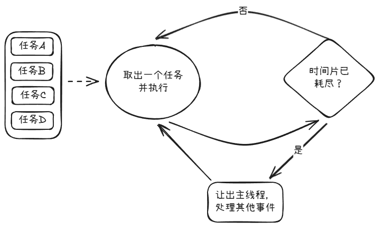
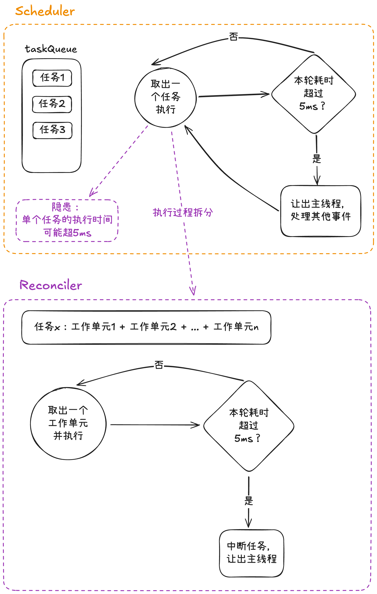
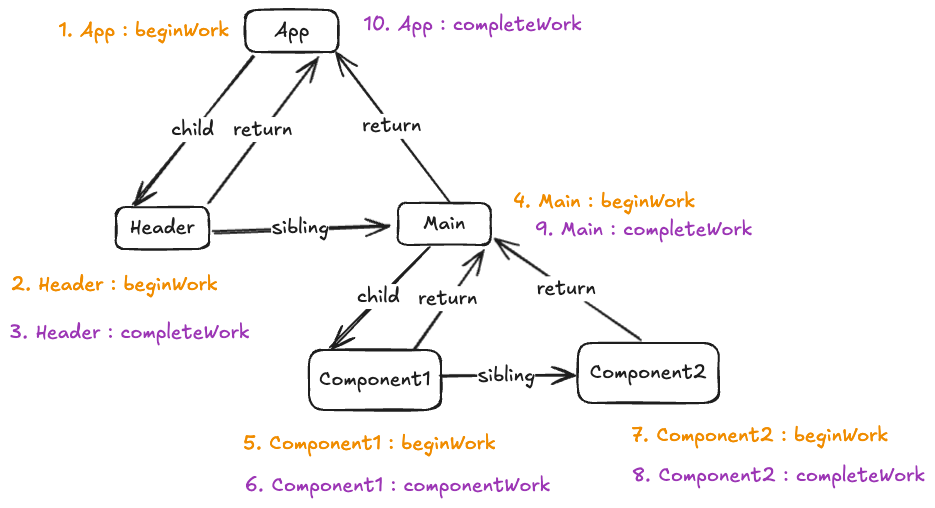

# 前言

本文的主题为：在 React 应用中，从组件状态改变到页面更新这一过程发生了什么。

主要目的是通过这个过程，将前几篇零散的 React 源码知识串连起来，形成知识网络，便于理解。

所以本文将不会过多介绍 React 中的一些基础概念，部分核心知识点见文章：

- [fiber 架构](https://github.com/lrhhaha/study-notes/blob/main/frontend/React/React%20%E6%9E%B6%E6%9E%84%E8%AE%BE%E8%AE%A1%EF%BC%9A%E4%BB%8E%20stack%20reconciler%20%E5%88%B0%20fiber%20reconciler%20%E7%9A%84%E6%BC%94%E8%BF%9B.md)
- [并发任务管理策略](https://github.com/lrhhaha/study-notes/blob/main/frontend/React/%E6%97%B6%E9%97%B4%E5%88%87%E7%89%87%20%2B%20%E5%8F%8C%E5%B7%A5%E4%BD%9C%E5%BE%AA%E7%8E%AF%20%2B%20%E4%BC%98%E5%85%88%E7%BA%A7%E6%A8%A1%E5%9E%8B%EF%BC%9AReact%20%E7%9A%84%E5%B9%B6%E5%8F%91%E4%BB%BB%E5%8A%A1%E7%AE%A1%E7%90%86%E7%AD%96%E7%95%A5.md)
- [diff 算法](https://github.com/lrhhaha/study-notes/blob/main/frontend/React/React%20%E5%8F%8C%E7%BC%93%E5%AD%98%E6%9E%B6%E6%9E%84%E4%B8%8E%20Diff%20%E7%AE%97%E6%B3%95%E4%BC%98%E5%8C%96.md)
- [函数组件与 Hooks](https://github.com/lrhhaha/study-notes/blob/main/frontend/React/React%E5%87%BD%E6%95%B0%E7%BB%84%E4%BB%B6%E4%B8%8EHooks%E5%AE%9E%E7%8E%B0%E5%8E%9F%E7%90%86.md)

# 过程拆分

接下来我们会将整个过程按照发生的顺序进行拆分：

- 状态发生改变
- scheduler 调度渲染任务
- render/reconcile 阶段
- commit 阶段

## 从状态更新说起

React 组件的重新，一般是由状态更新而引起的。也就是由 useState 返回的 setState 函数的调用所引起的。本小节将梳理 setState 函数被调用后发生了什么（关于 useState 与 setState 详情，见[文章](https://github.com/lrhhaha/study-notes/blob/main/frontend/React/React%E5%87%BD%E6%95%B0%E7%BB%84%E4%BB%B6%E4%B8%8EHooks%E5%AE%9E%E7%8E%B0%E5%8E%9F%E7%90%86.md#usestate)）。

setState 函数在源码中的体现是 dispatchSetState 函数，其接收 3 个参数作为函数。

- fiber：fiber 节点的引用
- queue：当前 hook 对象的 update 对象链表
- action：setXXX 的参数，可为函数或普通值

在 useState 执行时，会使用 bind 函数提前绑定其前两个参数（这就是为什么 React 知道当 setXXX 被调用时，究竟需要修改哪个组件的哪个状态的原因），然后将返回的函数作为 useState 返回值的第二个元素。

所以平时我们在调用 setState 函数时，只需传入一个值（具体值或函数），作为 dispatchSetState 的第三个函数而执行。

dispatchSetState 函数执行时，具体会执行以下几个步骤：

1. 进行 Eager state 优化：比较上次的值和本次修改的值，如两者相等则不触发后续的更新步骤。
2. 为本次更新创建 update 对象
3. 将 update 对象挂载到当前 useState 的 hook 对象的 update 链表上（以环形链表的方式存储）
4. 调用 scheduleUpdateOnFiber 函数，发起后续更新。
   1. 从触发更新的 fiber 节点往上寻找其所有直接父节点，并标记此路径上 fiber 节点的 lanes 和 childLanes 属性（以表示当前节点有更新操作或其子孙节点存在更新操作，为后续 render 阶段的 bailout 优化做铺垫）
   2. 将 root 节点丢给 scheduler 发起一次任务调度

## scheduler 任务调度

> 任务调度相关基础，见[文章](https://github.com/lrhhaha/study-notes/blob/main/frontend/React/%E6%97%B6%E9%97%B4%E5%88%87%E7%89%87%20%2B%20%E5%8F%8C%E5%B7%A5%E4%BD%9C%E5%BE%AA%E7%8E%AF%20%2B%20%E4%BC%98%E5%85%88%E7%BA%A7%E6%A8%A1%E5%9E%8B%EF%BC%9AReact%20%E7%9A%84%E5%B9%B6%E5%8F%91%E4%BB%BB%E5%8A%A1%E7%AE%A1%E7%90%86%E7%AD%96%E7%95%A5.md#scheduler)

scheduler 基于 MessageChannel 发起任务的调度，MessageChannel 的通信是宏任务，浏览器通过事件循环机制调控，确保不会阻塞现有任务。

当进入任务执行阶段时，scheduler 从任务池中（通过小顶堆的方式）取出优先级最高的任务执行。

需要注意的是，任务池中往往不止有一个渲染任务，如果清空任务池的过程是以同步的方式执行的话，则可能会长时间阻塞主线程，导致用户的一些操作（如文本输入、UI 交互）需要较长时间才会得到反馈，让用户产生应用卡顿的感觉。

为了使清空任务池的过程中能`及时响应`用户操作，scheduler 会基于时间切片 + 任务调度循环 + 优先级模型的方式进行调控。

具体而言就是以时间片为单位执行任务，每执行完一个任务之后，会调用 shouldYieldToHost 函数判断当前时间片是否耗尽：如没耗尽则取出下一个优先级最高的任务执行；如耗尽则让出主线程并发起下一次任务调度。

具体流程如图所示：



> 关键源码函数：
>
> - schedulePerformWorkUntilDeadline 请求任务调度（通过 MessageChannel 发送消息）
>
> - performWorkUntilDeadline 响应任务调度请求（MessageChannel 另一个端口的 onmessage 函数）
>
>   - workLoop 执行 scheduler 层的工作循环（执行具体渲染任务，并调用 shouldYieldToHost 判断时间片是否耗尽），返回值 hasMoreWork 为是否有剩余任务
>     - 根据 hasMoreWork 决定是否调用 schedulePerformWorkUntilDeadline 请求下一次的任务调度

上面描述的任务层面的工作循环实际上并不够细致，因为其判断当前时间切片是否耗尽的时间点是在`每个任务执行完毕之后`，但如果一个渲染任务非常庞大，它的执行时间远超时间片本身，那么同样会导致长时间阻塞主线程的情况出现。

所以接下来我们需要深入单个任务的执行过程，看看 React 是如何防止单个渲染任务长时间阻塞主线程的。

## render/reconcile 阶段

当 scheduler 取出一个渲染任务并执行时，则进入了 render/reconcile 阶段。

在 Fiber 架构的背景下，一个渲染任务会被拆分为多个工作单元（即 fiber 节点）。

所以一个渲染任务的执行过程，可视为其工作单元的执行过程，当一个任务的全部工作单元执行完毕，则视为当前渲染任务执行完毕。

整个 render/reconcile 阶段可视为循环执行 preformUnitOfWork 的过程，每执行一次 performUnitOfWork 可视为执行一个工作单元。

同样地，为了防止遍历执行工作单元而长期阻塞主线程，在循环执行 preformUnitOfWork 的过程中，也会有一个工作循环（可称为 Fiber 构建循环）用于判断当前时间切片是否使用完毕，从而决定让出主线程还是继续执行下一个工作单元。

值得一提的是，此 Fiber 构建循环是在 react-reconciler 包中，而不是 Scheduler 包中，因为 Fiber 工作单元的执行属于协调过程。

scheduler 任务调度循环与 fiber 构建循环的关系如下图所示：


fiber 构建循环关键代码如下所示

```javascript
function workLoopConcurrent() {
  // Perform work until Scheduler asks us to yield
  while (workInProgress !== null && !shouldYield()) {
    performUnitOfWork(workInProgress); // 执行单个工作单元
  }
}
```

### performUnitOfWork

接下来将拆分 performUnitOfWork 的执行过程：

performUnitOfWork 可视为两个阶段：

1. beginWork：通过 diff 算法，高效生成当前 fiber 节点的直接子节点
2. completeWork：标记 flags 及 subtreeFlags，创建 DOM 元素及标记 update

> 注意：虽然 performUnitOfWork 可分为 beginWork 和 completeWork 两个阶段，但并非一个工作单元执行完其 beginWork 和 completeWork 的逻辑，再执行下一个工作单元的 beginWork 和 complete。
>
> 而是属于一个递归的过程：
>
> - 递：先从根节点开始往下，执行其`第一个子节点`的 beginWork 逻辑，然后再以此节点作为出发点，寻找其第一个子节点执行 beginWork，如此往复；
> - 归：到达叶子节点之后，执行其 completeWork 逻辑，然后寻找下一个需要执行 beginWork 的节点（先寻找兄弟节点，再寻找父级节点）。

具体顺序可理解为：parent:beginWork -> child:beginWork -> child:completeWork -> sibling:beginWork -> sibling:completeWork -> parent:completeWork

配合 fiber 架构的链式树状结构，整个递归过程可以归纳为：


#### Fiber 构建循环中时间切片的判断时机

performUnitOfWork 被包裹在循环中执行，每个 performUnitOfWork 执行完毕的时机为：`找到下一个需要执行beginWork逻辑的fiber节点`：

- 当处于“递”的过程且当前 fiber 节点有子节点时，`下一个需要执行beginWork的节点`就是其第一个子节点。
- 当处于“归”的过程时，如果当前节点有兄弟节点，那么`下一个需要执行beginWork的节点`就是其兄弟节点，否则需要往上执行其 parent 节点的 completeWork 逻辑，然后将其 parent 节点视为当前节点，寻找`下一个需要执行beginWork逻辑的节点`（即找其兄弟节点，如无，再对其 parent 执行 completeWork）。

结合上面提到的 fiber 构建循环的代码可知：在 fiber 构建循环中，时间切片的判读时机为：`找到下一个需要执行beginWork逻辑的fiber节点时`。

```javascript
function workLoopConcurrent() {
  while (workInProgress !== null && !shouldYield()) {
    // 每找到“下一个需要执行beginWork逻辑的fiber节点”时，函数执行完毕，进行一次时间片判断
    performUnitOfWork(workInProgress);
  }
}
```

#### beginWork

beginWork 的主要目的为：为当前节点的直接子节点生成（新生成或复用旧节点） workInProgress 节点，及判断真实 DOM 节点是否可以复用。

在正式开始执行核心逻辑之前，会先进行 bailout 优化的判断（根据 fiber 的 lanes 及 childLanes 属性判断）。bailout 是跳过 re-render，即无需执行函数组件，而不是不遍历。即进入遍历流程后，发现符合 bailout 条件，则无需 re-render 。

- bailout 判断条件：先判断 props / context 的实际值变化 ，再判断 lanes 和 childLanes 是否有工作要做：
  - 如果 props/context 无变化，且 lanes 和 childLanes 都无值，则当前整条分支 bailout（常见于状态更改的兄弟分支）
  - 如 props/context 无变化，lanes 无值，但 childLanes 有值，则当前 fiber 可 bailout，继续对其子树进行遍历（常见于状态发生改变的直接父级组件）

不能进行执行 bailout 优化的节点就需要执行 reconcileChildren，即进行 diff 算法对比，从而生成当前节点的所有直接子节点（diff 对比相关流程见[文章](https://github.com/lrhhaha/study-notes/blob/main/frontend/React/React%20%E5%8F%8C%E7%BC%93%E5%AD%98%E6%9E%B6%E6%9E%84%E4%B8%8E%20Diff%20%E7%AE%97%E6%B3%95%E4%BC%98%E5%8C%96.md)）

#### completeWork

当 beginWork 处理到叶子节点时，调用 completeUnitOfWork（核心为 completeWork）向上递归。

其作用主要为：

- 标记自身 flags 属性，代表在 commit 阶段需要如何修改 DOM（需要与 effectList 区分开）。以及向上收集 flags，标记父级节点的 subtreeFlags（类似 childLanes，代表其子孙元素是否需要更改 DOM，为后续 commit 阶段的剪枝优化做准备）
- 对于 HostComponent（如 div、span），创建 DOM 节点或标记 update

## commit 阶段

当某个渲染任务执行完毕后（即其中的所有工作单元都执行完了 beginWork / completeWork），React 就会调用 commitRoot 函数进入 commit 阶段。

与 render/reconcile 阶段不同，整个 commit 阶段的执行是同步不可中断的。其主要作用：一次性地把更新提交到真实 DOM 上，并执行副作用函数和生命周期钩子。

整个 commit 阶段可理解为有三个同步子阶段 + 一个异步子阶段，分别如下所示：

- 同步阶段：
  - Before Mutation
  - Mutation
  - Layout
- 异步阶段：
  - Passive Effects

各个阶段的主要功能如下所示：

- beforeMutation 阶段：处理 DOM 变更前的准备工作，如执行`旧的 useLayoutEffect 的 cleanup`
- mutation 阶段：根据 flags 属性，`对真实 DOM 更新`（插入、更新、删除）
- （注：一般认为此时会进行 current 树与 workInProgress 树的切换）
- layout 阶段：ref 的绑定；执行`新的 useLayoutEffect 回调`，执行 `componentDidMount/Update` 等生命周期钩子
- （注：此时浏览器会绘制页面（paint））
- passive effects 阶段：
  - `旧的 useEffect cleanup` 放入任务队列
  - `新的 useEffect 回调`放入任务队列

而上述提到的四个子阶段，并非所有 fiber 阶段都要执行对应的逻辑，而是每个子阶段会有自己的剪枝优化逻辑，会对 fiber 节点的某些属性（如 flags、subtreeFlags）进行判断，如符合要求则某些子树可以跳过当前子阶段逻辑。

> 补充：\
> 由上述四个子阶段的执行过程可知，useLayoutEffect 和 useEffect 的执行顺序如下：
>
> 1. 旧 useEffectLayout 的 cleanup
> 2. DOM 更新（但未绘制）
> 3. 新 useLayoutEffect 的回调
> 4. 浏览器绘制页面
> 5. 旧 useEffect 的 cleanup
> 6. 新 useEffect 的回调

# 总结

本文以`从状态改变到页面更新`为轴，串联起了 React 中几个核心的源码知识点，主要起到梳理作用，具体每个步骤的详细知识点，还需移步其他文章复习。
