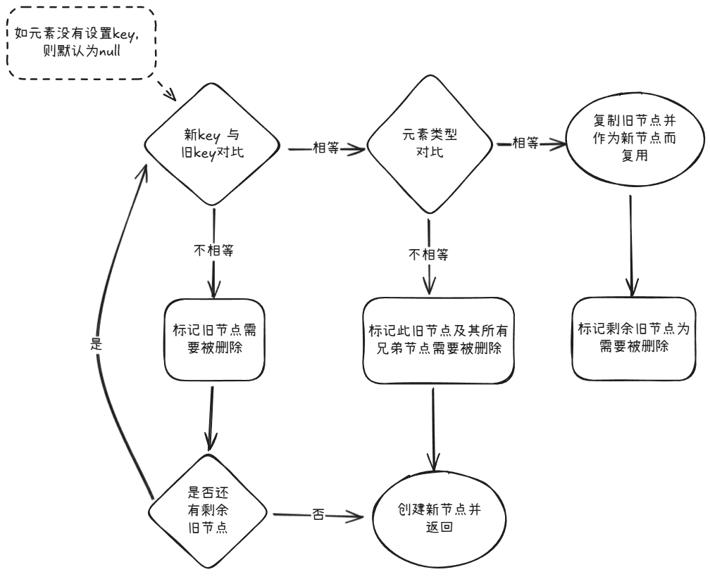
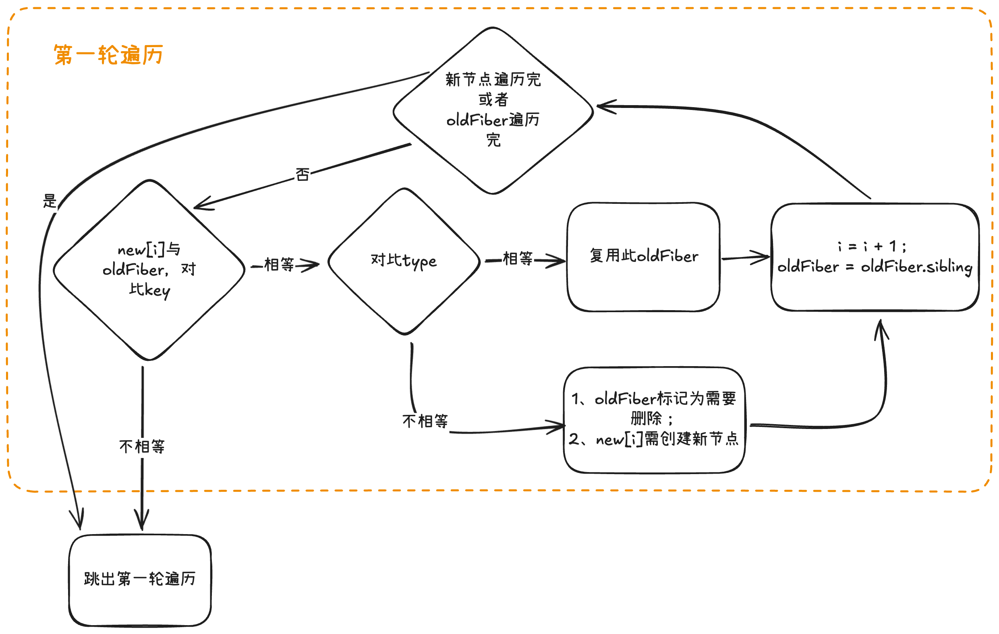
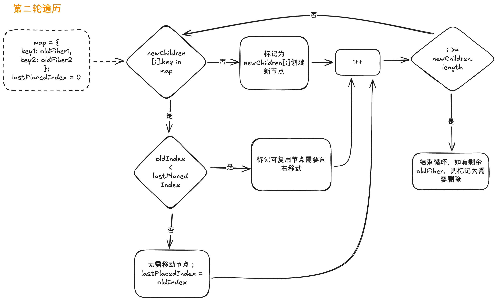

# 题目：React 双缓存架构与 diff 算法优化

# 前言

提到 React 应用的页面更新优化策略，会有两个绕不开的概念，它们分别是双缓存架构和 diff 算法。

其中 React 利用双缓存架构在内存中生成下次要渲染的页面所对应的虚拟 DOM 树，并且一次性地将需要更新的地方提交到真实 DOM 上，以避免页面出现白屏的情况。
而 diff 算法则是负责实现高效的虚拟 DOM 对比。

本文将分享 React 中双缓存架构 + diff 算法是如何优化页面更新的过程，以及它们背后的逻辑究竟是怎么样的。

# 双缓存架构

React 维护了两棵 Fiber 树（即虚拟 DOM 树）：`current fiber tree`和`workInProgress fiber tree`。`current`树代表当前屏幕上显示的内容信息，`workInProgress`树代表下次更新需要展示的内容信息。基于这两颗 Fiber 树的页面渲染架构就称为双缓存架构。

之所以需要使用两颗 Fiber 树去辅助页面更新，是因为:

> 如果我们没有 workInProgress 树去记录下次页面更新时，需要执行哪些增删改的操作，那么就只可以将页面清空，然后执行新增操作，将整个页面元素重新生成，那么此过程不仅影响应用性能，还可能因为绘制时间过长，造成白屏的情况。
>
> 而基于双缓存树架构，我们可以使用当前页面的结构信息（即 current fiber tree）与下次更新后的页面结构信息（即 JSX 元素编译后的 React 元素）进行对比，从而生成 workInProgress fiber tree，它记录了下次更新时，基于当前页面，有哪些元素需要执行增删改的操作，力求通过复用旧元素，以最小代价更新页面。

# workInProgress 树的生成过程

在[前一篇文章](https://github.com/lrhhaha/study-notes/blob/main/frontend/React/React%20%E6%9E%B6%E6%9E%84%E8%AE%BE%E8%AE%A1%EF%BC%9A%E4%BB%8E%20stack%20reconciler%20%E5%88%B0%20fiber%20reconciler%20%E7%9A%84%E6%BC%94%E8%BF%9B.md)中提到，React 更新页面的过程，可以宏观地分解为 `Render / Reconciliation 阶段`和 `Commit 阶段`。\
Render 阶段的主要任务就是：高效对比 current 树与新的 React 元素，生成 workInProgress 树。

而如何高效对比 current 树与新的 React 元素，使用的就是所谓的 diff 算法。

> diff 算法的输入： current fiber 节点 + 新的 React 元素\
> diff 算法的输出：workInProgress 树（记录下次页面更新需要基于当前 DOM 结构执行哪些操作）

简而言之：在开始协调生成 workInProgress 树的时候，workInProgress 会复制得到 current 树的副本，然后 current 树和新的 React 元素进行 diff 对比，在此过程中对 workInProgress 树进行标记（记录对应节点需要执行的操作）。

落实到关键代码中，主要体现在 performUnitOfWork 方法中。此方法接收 current 树的节点作为参数，进行 diff 对比生成 workInProgress 树节点后。最后将 workInProgress 指向下一个需要执行的 current 树的节点（由调度器决定是否继续对返回的节点执行 performUnitOfWork 方法，本文暂不展开）。

整个 performUnitOfWork 分为两个`递`和`归`两个阶段，分别执行`beginWork`和 `completeWork`方法。

两个方法的主要任务为：

- beginWork：
  - 判断当前节点及其子孙节点是否发生了改变（使用 lanes 及 ChildLanes 属性），如果没有改变，则进行 bailout 优化，跳过整个子树的处理，直接复用之前的节点。
  - （如子孙节点发生了变化）使用 reconcileChildFibers 去生成直接子节点。而这个过程，则需要调用 diff 算法去优化 workInProgress 树的生成过程。 （reconcileChildFibers 返回 nextFiber，作为 beginWork 的返回值及下次 performUnitOfWork 的参数）
- completeWork：
  - 负责完成节点的处理工作，包括 DOM 节点的创建、属性的设置等。
  - 在此阶段，React 会收集所有副作用标记（即 flags、subtreeFlags 属性），这些标记记录了组件在 commit 阶段需要执行的操作。

# diff 算法详解

diff 算法的责任是高效地对两颗树进行对比，在保证对比开销的同时，尽可能地复用旧节点。

首先我们先了解一下，diff 算法判断旧节点可复用的标准是什么，然后再去理解 diff 算法是如何匹配新旧节点并进行对比的。

## 组件复用判断条件

为了降低算法复杂度，React 会预设三个限制来辅助判断组件是否能复用:

- 同层对比：只在同一层级的节点之间进行 diff 对比。
- 使用 key 属性作为元素的 `唯一标识`：key 值相同的两个节点会被视为同一个节点而进行精确匹配对比。
- 类型不同的元素产生不同的树：如元素从 `<div>`变为 `<p>`，因为类型改变，默认不能复用旧 DOM 节点，直接删除旧 `<div>`节点及其子孙节点，并新建 `<p>`节点及其子孙节点。

> 注意：\
> 在列表渲染的情况下，React 会提示必须为每一项设置 key 作为唯一标识，以便在重新渲染时能精确匹配进行对比。
>
> 而在非列表渲染的情况下，React 则没有要求必须为元素设置 key 值。但在必要的情况下，也可以使用 key 值作为优化手段。（在没有设置 key 值的时候，key 的默认值为 null。）

则组件复用的判断逻辑如下：

1. 只对同级组件进行判断
2. 优先判断 key 值是否相等
3. key 值相等的情况下，组件类型 type 也相等，则组件可复用。

## diff 入口

diff 的入口函数是 reconcileChildFibers。

其中需要关注的参数为：

- currentFirstChild：current 树中将要进行对比的子节点的第一个子节点（其余子节点通过其 sibling 节点链接）
- newChild：新渲染的 React 元素的子节点（们）

因为对于不同类型的 newChild 会有不同的处理函数，所以需要先判断其类型，常见类型为 Object 和 Array（分别代表单个子节点和多个子节点），还有如 number 和 string 等（本文暂不讨论）。

```typescript
function reconcileChildFibers(
  returnFiber: Fiber,
  currentFirstChild: Fiber | null, // current节点的子节点
  newChild: any, // 将要渲染的children节点
  lanes: Lanes
) {
  // 伪代码：判断newChild是否为单个节点
  if (isObject(newChild)) {
    reconcileSingleElement(returnFiber, currentFirstChild, newChild, lanes);
  }

  // 伪代码：判断newChild是否为多个节点
  if (isArray(newChild)) {
    reconcileChildrenArray(returnFiber, currentFirstChild, newChild, lanes);
  }

  // 省略其他情况
}
```

接下来我们分别讨论 newChild 为单节点和多节点的情况。

## 单节点 diff

当 newChild 为单节点的时候，只会执行一轮遍历操作：

- 优先对比 key 值（无显式设置则默认为 null）。
- 如 key 值匹配成功，再对比元素类型，类型相等则可复用旧节点。如元素类型不相等，则证明旧节点不能复用，直接标记删除所有旧节点。diff 结束。
- 如 key 值匹配不成功，则标记此旧节点需要删除（而不删除它的兄弟节点，因为其他兄弟节点的 key 值可能会匹配成功），继续使用下一个兄弟节点进行对比，直至对比完所有旧节点。

具体流程图如下所示：


## 多节点 diff

当 newChild 为多节点的时候（后续使用 newChildren 表示），则需要使用新的对比逻辑，分为两轮遍历。

### 第一轮遍历

- 遍历 newChildren，将 newChildren[i]与 oldFiber 比较，判断两者 key 值是否相等：

  - 如 key 值相同，则继续判断 type 是否相同，相同则可复用旧节点，否则将 oldFiber 标记为需要被删除，并标记为 newChildren[i]创建新节点使用。继续进行遍历对比 newChildren[++i]与 oldFiber.sibling。

  - 如 key 值不相同，则立即跳出整个遍历，第一轮遍历结束。

即第一轮遍历的的结束条件有两个：

- 遍历时出现 key 值不匹配的情况。
- newChildren 数组遍历完`或者`oldFiber 遍历完(即 oldFiber.sibling === null)。

具体流程如下图所示：


第一轮遍历结束，即进行第二轮遍历流程

### 第二轮遍历

#### 四种情况

进入第二轮遍历时，会有如下四种情况：

- newChildren 和 oldFiber 同时遍历完：
  新旧节点都遍历完，无需进行第二轮遍历，diff 结束。

- newChildren 未遍历完，oldFiber 遍历完：
  此时因为 oldFiber 都已遍历完，证明所有旧 DOM 节点都已复用，剩下的 newChildren 都需要创建新的 DOM 节点来使用，diff 结束。

- newChildren 遍历完，oldFiber 未遍历完：
  此时意味着所有新的节点都已拥有对应的 DOM 节点，而剩余的 oldFiber 节点则无需再使用，标记为需要被删除，diff 结束。

- newChildren 和 oldFiber 都没遍历完：
  此时意味着有节点在此次更新中更换了位置，需要进行第二轮遍历以找出可以复用的节点。

#### 正式流程

在正式开始前，我们需要把 oldFiber 中剩余的节点放到一个 Map 中，形成形如`{key: fiber}`的形式。以便后续在遍历剩余 newChildren 时，能直接通过 key 值定位到对应的 oldFiber。

接下来有一个变量`lastPlacedIndex`，它`记录了上一个不需要移动的节点的原始下标`。第二轮遍历开始时，它的值为 0。

遍历逻辑如下所示：

- 遍历 newChildren，寻找当前新节点 newChildren[i]的 key 值是否存在于 Map 中：

  - 如果 Map 中没有此 key 值，则证明没有能复用的旧节点，为此节点标记需要创建新节点。

  - 如果在 Map 中找到此 key 值对应的 oldFiber（假设 type 也相同），则证明此旧节点可以复用。然后判断其位置是否需要移动：使用此 oldFiber 在原列表中的下标（使用 oldIndex 表示）与 lastPlacedIndex 进行对比。

    - 如果 oldIndex >= lastPlacedIndex，则证明此 oldFiber 原本就在 lastPlacedIndex 的后面，无需移动。且将 lastPlacedIndex 赋值为 oldIndex。

    - 如果 oldIndex < lastPlacedIndex，则证明 oldFiber 原本在 lastPlacedIndex 的前面（而在新页面中，它应在 lastPlacedIndex 的后面），需要标记 oldFiber 为需要向右移动。

- 然后 i++，继续执行上述循环，直至 newChildren 遍历完毕（如遍历完毕后，还有剩余 oldFiber，则将它们标记为需要被删除）。

流程图如下所示：


## 例子

上述文字描述可能比较晦涩，接下来将使用一个例子进行介绍

使用节点的 key 值来代表节点：

- 当前页面展示的节点：abcde
- 下次更新展示的节点：adbc

> =========第一轮遍历开始=========
>
> ---------第一个迭代开始---------
>
> 新节点 key 值：a\
> 旧节点 key 值：a\
> 两者 key 值相等（假设 type 也相等），则旧节点可以复用
>
> ---------第一个迭代结束---------
>
> ---------第二个迭代开始---------
>
> 新节点 key 值：d\
> 旧节点 key 值：b\
> 两者 key 值不相等，无需判断 type，直接结束第一轮遍历
>
> ---------第二个迭代结束---------
>
> =========第一轮遍历结束=========
>
> =========第二轮遍历开始=========
>
> newChildren === dbc，没用完，不需要执行删除旧节点\
> oldFiber === bcde，没用完，不需要执行插入新节点
>
> 为 oldFiber 创建 map 结构，形如：\
> {\
> b：oldFiber-b\
> c：oldFiber-c\
> d：oldFiber-d\
> e：oldFiber-e\
> }
>
> 创建 lastPlacedIndex 变量，初始值为 0。
>
> ---------第一个迭代开始---------
>
> 查找 key 值是否存在：d in map // true
>
> map 中存在目标 key 值，且假设 type 相同，则旧节点可以复用。
>
> 判断旧节点是否需要移动：\
> 节点 d 在原队列中下标为 3（原队列为 abcde），lastPlacedIndex 为 0。\
> 即 oldIndex > lastPlacedIndex，旧节点无需移动，且赋值 lastPlacedIndex = oldIndex = 3
>
> ---------第一个迭代结束---------
>
> ---------第二个迭代开始---------
>
> 查找 key 值是否存在：b in map // true
>
> map 中存在目标 key 值，且假设 type 相同，则旧节点可以复用。
>
> 判断旧节点是否需要移动\
> 节点 b 在原队列中下标为 1（原队列为 abcde），lastPlacedIndex 为 3。\
> 即 oldIndex < lastPlacedIndex，旧节点需要标记为向右移动，lastPlacedIndex 无需重新赋值。
>
> ---------第二个迭代结束---------
>
> ---------第三个迭代开始---------
>
> 查找 key 值是否存在：c in map // true
>
> > map 中存在目标 key 值，且假设 type 相同，则旧节点可以复用。
>
> 判断旧节点是否需要移动\
> 节点 c 在原队列中下标为 2（原队列为 abcde），lastPlacedIndex 为 3。\
> 即 oldIndex < lastPlacedIndex，旧节点需要标记为向右移动，lastPlacedIndex 无需重新赋值。
>
> ---------第三个迭代结束---------
>
> 此时 newChildren 已遍历完毕。oldFiber 中还有 e 节点未使用，标记为需要删除。
>
> =========第二轮遍历结束，diff 结束===========

从上述例子可以看出，我们将元素从 abcde 重新排序为 adbc，按道理来说，只需删除 e 节点，并将 d 节点移动到第二位即可。\
而根据 React 的 diff 算法，会将 bc 节点往后移动，而 d 节点不变。\
由此可知，为了性能考虑，我们应该尽量减少将节点从后往前移动的操作。

# 总结

本文介绍了 React 使用双缓存架构解决页面更新时出现白屏的情况，以及同时能够以最小代价更新真实 DOM，优化了渲染过程。\
而对比 current 树和新 React 元素生成 workInProgress 树的过程是个复杂的过程，React 分别针对单节点对比和多节点对比设计了两套 diff 算法，提高整个对比过程的效率。

分析 diff 算法的特性，我们得出编写 React 代码时的最佳实践：

1. 尽量减少将节点从后往前移动的操作。
2. 有必要时（如大型组件位置频繁交换）使用 key 值标记元素，以便复用 DOM 元素。

# 参考文章

https://react.iamkasong.com/diff/prepare.html
