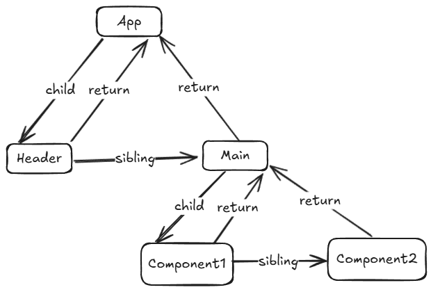
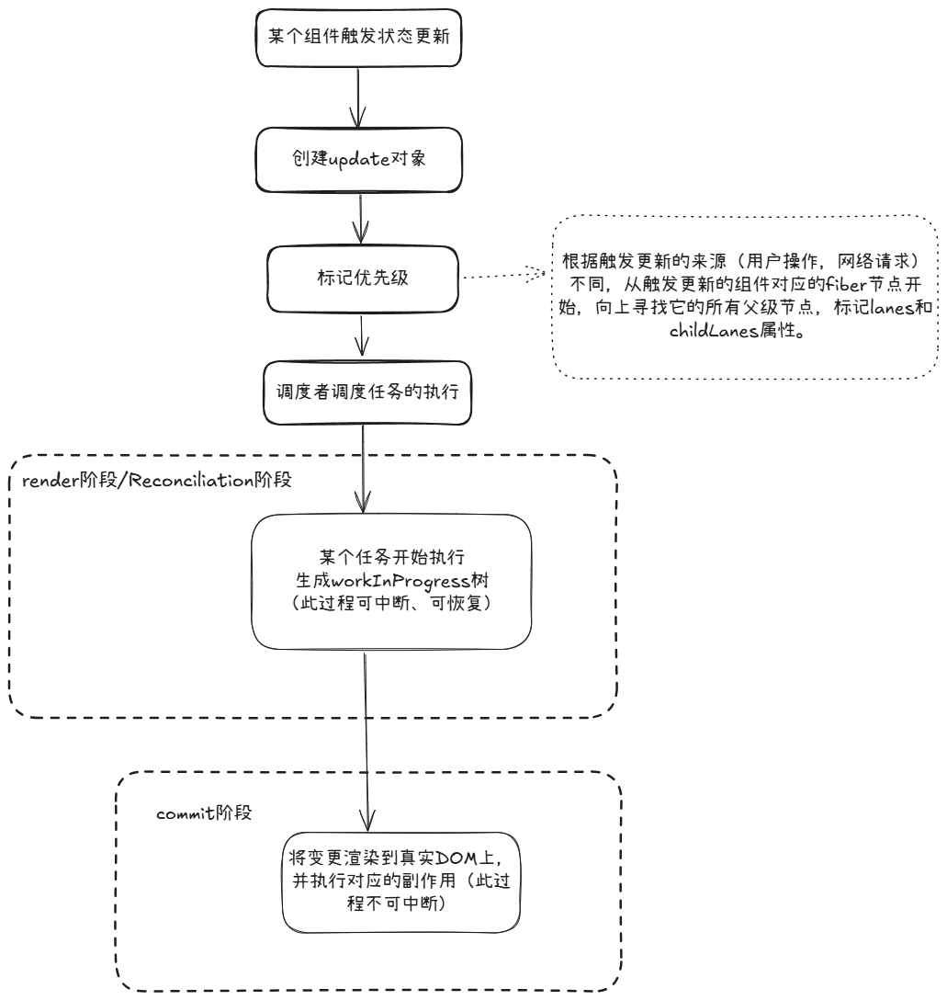

# 题目： React 架构设计：从 stack reconciler 到 fiber reconciler 的演进

# 零、前言

本文将会讨论 React16 之前 stack reconciler 的特点及性能隐患，以及 React16+ 的 fiber reconciler 的优化思想及 fiber 节点的核心属性。

本文后续遵循以下约定：

1. React 应用 UI 更新过程从宏观上拆分为 render 阶段（或 Reconciliation 阶段）和 commit 阶段。
2. render 阶段主要负责生成新的虚拟 DOM，并计算如何以最小代价更新真实 DOM。
3. commit 阶段主要负责将 render 阶段计算好的更新内容提交到真实 DOM 上。
4. render 阶段的核心称为 Reconciler（协调器）。
5. commit 阶段的核心称为 Renderer（渲染器）。

# 一、stack reconciler 与 fiber reconciler 的前世今生

在 React16 之前，当应用状态发生改变，宏观上会执行以下两部分的工作，以更新 UI：

1. Reconciler（协调器）会生成新的虚拟 DOM，并与旧的虚拟 DOM 进行对比，找出需要更新的部分。
2. Renderer（渲染器）根据 Reconciler 计算的结果，将需要更新的部分提交到真实 DOM 上。

Reconciler 在处理组件树的更新时，采用的是递归的方式，是一个`不可中断`的过程（即 stack reconciler），而 JS 作为单线程语言，在此过程中不能处理其他任务（如响应用户的输入操作等）。这就造成了应用交互卡顿的风险，且在递归的过程中，需要创建大量的调用栈，这在处理大型组件树的时候可能会导致栈溢出。

举个 🌰：\
当应用触发了状态变更，需要更新 UI，假设本次更新非常复杂，需要耗费 100ms，那么在这 100ms 内，如果用户进行了其他操作，如在输入框中输入文本。按照 stack reconciler 的设计，Reconciler 的工作过程不可中断，必须等待前一个渲染任务完成后，才能进行后续的输入框内容的变更。这就导致了应用卡顿的情况。

总结一下，React16 之前的 Reconciler 存在的问题：

1. 采用递归方式处理组件树，可能会导致调用栈的溢出。
2. 递归处理组件树的整个过程是不可中断的，这会阻塞用户的交互或其他重要的任务。
3. 更新任务没有优先级的概念，无法区分重要任务（如用户输入后的页面渲染）与普通任务（如数据请求后的页面渲染），无法调度它们的执行顺序，普通任务可能会阻塞重要任务的执行。

为此 React 团队计划在 React16 中重构 Reconciler 的逻辑，以实现应用在 Reconciler 工作时能`中断任务并优先处理优先级较高的任务`，如用户交互操作。并将这个新的方式称为 Fiber Reconciler。（而 Renderer 的工作逻辑不变，其执行过程仍然是不可中断的）。

再举个 🌰：\
对于上述耗时 100ms 的更新而言，当 Reconciler 工作到一半时，用户突然在输入框中输入文本，那么对于这种由于用户操作而造成的状态变更，在 React 中具有最高优先级。React 会暂停当前 Reconciler 的工作，转而去处理优先级更高的用于输入事件，将文本渲染出来，然后再回去处理刚才中断的任务。站在用户的角度，那个 100ms 的渲染确实是耗时较长，但整个 react 应用在此过程没有卡顿的情况出现，时刻能响应用户的操作。

> 简而言之：Fiber 架构`不是让渲染变快`，而是让`关键任务永不等待`。

为了实现 render 阶段可中断，fiber 架构比对之前的架构做出了如下重大改变：

1. 将 stack reconciler 中一整个渲染任务拆分为多个任务，为渲染过程的可中断提供了可能性。

2. 实现渲染任务的可中断与可恢复，在执行某个渲染任务时，如果应用触发了优先级更高的任务，则可暂停当前任务，优先处理高优先级任务，然后回来恢复之前的任务。

3. 引入优先级调度系统，不同类型的更新任务有不同优先级，调度系统自动决定任务执行的先后顺序。

# 二、fiber 节点 与 fiber 树

Fiber 包含三层含义：

1. 作为数据结构来说，一个 fiber 节点对应一个 React 元素（React 组件、原生标签等），保存了该元素的所有信息，作为虚拟 DOM 的节点使用。而 fiber 节点组成的`链式树状结构`就是 Fiber 架构下虚拟 DOM 的实现方式。

2. 作为架构来说，Reconciler 的生成虚拟 DOM 的过程是基于 fiber 节点实现的可中断遍历的过程，此过程可称为 Fiber Reconciler。

3. 作为工作单元来说，一个 Fiber 节点代表一个工作单元，保存了本次更新中该组件改变的状态、要执行的工作（需要被删除/被插入页面中/被更新...）。

为了实现不可中断的递归更新重构为可中断的遍历更新，之前所使用的虚拟 DOM 树的元素数据结构已无法满足需求（因普通树状结构无法不依靠外界而实现递归中断后的状态记录），需要 fiber 节点提供相关属性以支持链式树状结构的搭建，以便在某个任务中断并恢复之后，Reconciler 知道下一个需要执行的任务是什么。

fiber 节点与结构相关的属性有如下三个：

- child: 指向子 Fiber 节点
- sibling：指向右侧第一个兄弟 Fiber 节点
- return：指向父级 Fiber 节点

依靠上述三个属性，将各个 fiber 节点连接成链式树状结构。假设有如下所示的 React 组件

```
<App>
  <Header />
  <Main>
    <Component1 />
    <Component2 />
  </Main>
</APP>
```

其 fiber 树结构如图所示



fiber 树的链式树状结构的遍历特点为：

1. 深度优先遍历
2. 处理当前节点，然后寻找下一个需要处理的节点
3. 下一个节点的寻找逻辑为：
   1. 有 child 节点则处理 child 节点
   2. 无 child 节点或已处理完毕，则处理 sibling 节点
   3. 没有 sibling 节点则回归 return 节点（return 节点寻找其 sibling 节点）

每个 Fiber 节点都保存了从哪里来，该往哪里去的信息（即使在某个节点处中断任务，后续仍可恢复遍历），这让可中断遍历提供了`结构`上的支持。

但这仅仅提供了结构上的支持，还需一个“调度者”去控制渲染任务何时、如何中断并恢复。

# 三、fiber 节点关键属性

接下来介绍 fiber 节点中的一些关键属性，并按照其功能进行分类

## Ⅰ、标识和类型属性

### 1、key

React 元素的 key 属性，用于优化列表对比过程

### 2、tag

此属性标识了 Fiber 节点的类型，这个标记不仅用于区分不同类型的节点，更重要的是指导 React 如何处理这个节点。不同类型的节点有不同的处理逻辑和生命周期。

```typeScript
// tag属性的值为WorkTag类型
export type WorkTag = 0 | 1 | 2 | 3 |......

// FunctionComponent: 0,        // 函数组件
// ClassComponent: 1,           // 类组件
// IndeterminateComponent: 2,   // 未确定类型的组件
// HostRoot: 3,                 // 根节点
// ......
```

### 3、elementType & type

elementType：创建 Fiber 时传入的“原始”组件类型

type：实际用于渲染的组件的类型

这两个属性比较容易混淆，列举如下三个例子帮助理解：

（1）对于原生元素而言，两者相同，就是标签名称

```
<div>Hello</div>
// elementType → 'div'
// type → 'div'
```

（2）对于普通组件而言，两者相同，指向组件本身

```
function MyComponent() { return <div>Hello</div>; }
// elementType → MyComponent（函数）
// type → MyComponent（函数）
```

（3）对于高阶组件返回的组件而言，两者有明显区别

可理解为 type 是解包之后的组件（elementType.type === type）

```
const Comp = React.memo(MyComponent);
// elementType → Memo 对象 { type: MyComponent, ... }
// type → MyComponent（函数本身）
```

## Ⅱ、树状结构相关属性

Fiber 节点通过以下三个属性形成链式树状结构：

### 1、return

指向父 Fiber 节点

### 2、child

指向第一个子 Fiber 节点

### 3、sibling

指向下一个兄弟 Fiber 节点

## Ⅲ、状态相关属性

### 1、memoizedProps

上一次渲染时使用的 props

### 2、memoizedState:

上一次渲染时使用的 state

### 3、pendingProps:

新的待处理的 props

### 4、updateQueue:

存储更新对象的队列

## Ⅳ、副作用相关属性

### 1、flags

标记该 Fiber 节点在 commit 阶段需要执行的副作用（如插入、更新、删除等），可能存在多个副作用。

在 React 中，使用二进制数字代表不同的副作用，并使用`与运算`的结果记录所有副作用。

```javascript
export const NoFlags = /*                      */ 0b0000000000000000000000000000000;
export const PerformedWork = /*                */ 0b0000000000000000000000000000001;
export const Placement = /*                    */ 0b0000000000000000000000000000010;
export const Update = /*                       */ 0b0000000000000000000000000000100;
export const Cloned = /*                       */ 0b0000000000000000000000000001000;
export const ChildDeletion = /*                */ 0b0000000000000000000000000010000;
export const ContentReset = /*                 */ 0b0000000000000000000000000100000;
export const Callback = /*                     */ 0b0000000000000000000000001000000;
```

每个二进制数字代表一种副作用，且最小单位的副作用的二进制数字中只包含一个 1。如果某个 fiber 节点需要执行两个副作用，则可使用它们对应的二进制数字进行与运算，得出拥有两个 1 的二进制数字，即可反推出这两个副作用是什么。

假设某个 fiber 节点既需要更新，又需要删除子节点，则其 flags 会进行如下运算

```
// 0b0000000000000000000000000010100
fiber.flags = Update | ChildDeletion;

// 0b0000000000000000000000000000100 | 0b0000000000000000000000000010000 = 0b0000000000000000000000000010100
```

### 2、subtreeFlags
子树中的副作用标记，记录子孙节点中是否有副作用，如有，则当前节点的 subtreeFlags 就不为 0。

在 commit 阶段，React 需要遍历 Fiber 树，找出哪些节点有副作用（flags ≠ 0）并执行它们。但如果某个节点的 subtreeFlags === 0，说明它的整个子树都没有副作用，React 就可以跳过遍历它的所有子孙节点，直接“剪枝优化”，节省大量无意义的遍历开销。

### 3、deletions
保存当前 fiber 节点的直接子节点中需要被删除的节点。

在协调过程中，被删除的节点就会从 Fiber 树中移除，无法通过 fiber 树寻找到。
但 commit 阶段仍需要找到它们并执行清理操作（如从 DOM 移除、执行生命周期钩子 /hooks）。
所以需要使用 deletions 属性保存这些节点。

## Ⅴ、双缓冲机制相关属性

### 1、alternate

指向另一个树中对应的 Fiber 节点
即 current fiber tree 和 workInProgress fiber tree 的互相引用，实现 fiber tree 的快速切换。

> current fiber tree：当前页面所对应的虚拟 DOM 树\
> workInprogress fiber tree：下次要渲染的页面所对应的虚拟 DOM 树

```
fiber.alternate.alternate === fiber // true
```

## Ⅵ、优先级相关属性

### 1、lanes

表示该 fiber 任务的优先级。
此属性的值和 flags 一样，也是二进制数字

```
export const NoLanes = /*                        */ 0b0000000000000000000000000000000;
export const SyncHydrationLane = /*              */ 0b0000000000000000000000000000001;
export const SyncLane = /*                       */ 0b0000000000000000000000000000010;
export const InputContinuousHydrationLane = /*   */ 0b0000000000000000000000000000100;
export const InputContinuousLane = /*            */ 0b0000000000000000000000000001000;
```

### 2、childLanes

记录了当前 Fiber 节点的子树中存在的所有更新优先级（lanes）

在协调阶段，React 会通过检查 childLanes 属性来判断子树中是否有更新，如果没有更新，则跳过子树的遍历。

# 四、从状态更新到页面渲染

接下来我们从宏观角度分解当某个组件的状态发生变化时，React 是如何对 UI 进行更新的。



对于 Fiber 架构而言，重点在于 render 阶段，此阶段的重点在于 workInProgress Fiber tree 的创建过程，以及协调算法如何优化此过程。

在下一篇文章中，我们将重点讨论此阶段的逻辑。

# 五、总结

本文介绍了

1. React 从 stack reconciler 到 fiber reconciler 转变的历程
2. Fiber 节点的重点属性
3. 基于 fiber 节点的链式树状结构
