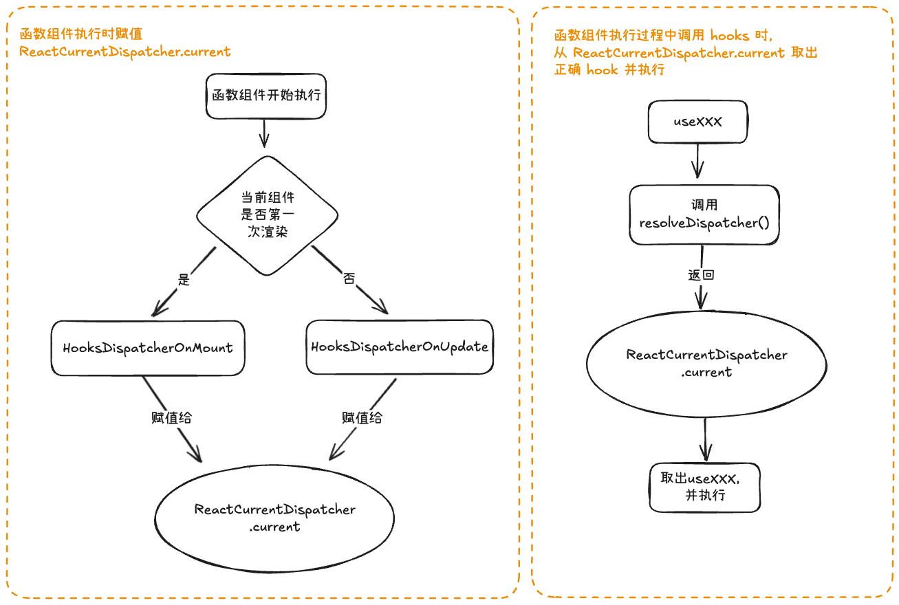
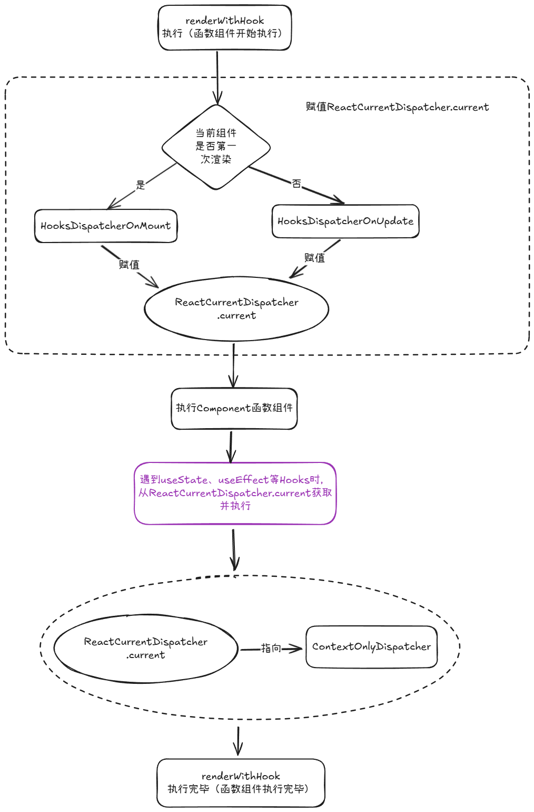
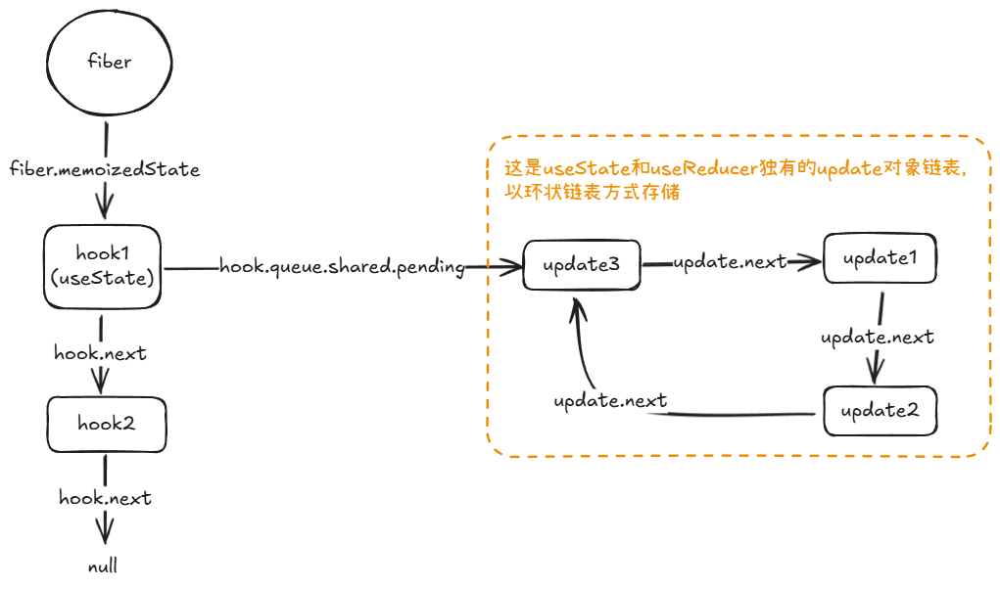
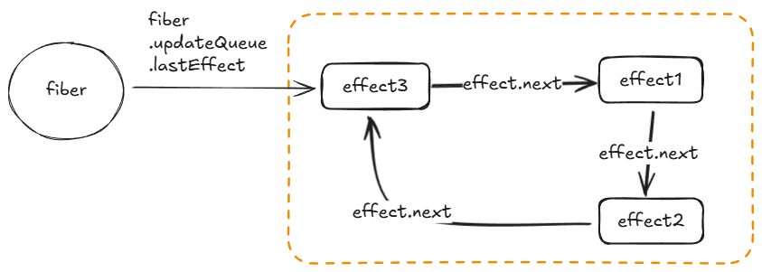

# 前言

我们在编写 React 应用的时候，会使用函数组件配合 Hooks 实现状态管理及其他能力，然而大家是否有深究过为何函数组件需要使用各种 Hooks 来实现其他能力，以及 Hooks 的本质究竟是什么？为什么它们的使用需要严格按照规范，这背后的原理究竟是什么？

本文将针对上述问题展开探讨，分析 Hooks 的本质，以及它们如何与函数组件进行结合，从而辅助函数组件实现各种功能的。

# Hooks 的前世今生

## React16.8 前的组件

在 React16.8 版本之前，React 有两种类型的组件，分别是`类组件`和`函数式组件`。

它们根本上的区别是，类组件有状态管理、生命周期、副作用等 React 能力，而函数组件则没有。

函数组件用普通的 JS 函数编写，只接收 props 并返回 JSX，不具备状态管理等 React 能力，所以也称为无状态函数组件（Stateless Functional Components）。

```javascript
// helloworld.js
export default (props) => (
  <div>
    <p>{props.greeting}</p>
  </div>
);

// Example use
<HelloWorld greeting="Hello World!" />;
```

所以在 React16.8 版本之前，大部分 React 组件都需要使用类组件来编写，而函数组件只能参与小部分的纯 UI 编写。

## 类组件的不足之处

但是承担着主要作用的类组件，却存在[三个不足之处](https://zh-hans.legacy.reactjs.org/docs/hooks-intro.html#motivation)：

### 组件间难以复用状态逻辑

类组件中没有实现逻辑复用的原生方案，如果需要在多个组件中复用逻辑，只能通过 [HOC（高阶组件）](https://zh-hans.legacy.reactjs.org/docs/higher-order-components.html) 或 [Render Props](https://zh-hans.legacy.reactjs.org/docs/render-props.html) 辅助，代码实现比较麻烦，而且多层嵌套后还会形成“嵌套地狱”的问题。

### 逻辑分散，复杂组件变得难以理解

在某些业务场景中，我们可能需要监听某个变量改变从而执行后续操作，或需要在组件挂载/卸载时执行某些操作。在类组件中，我们需要借助 componentDidUpdate、componentWillUnmount 等生命周期钩子辅助完成。

其中的问题是，假设有一个业务 A，需要使用到上述两个钩子，那么对应的逻辑则需要分别放在它们的回调函数中，造成一个业务的逻辑（在代码中）分散在两个地方，且会与其他业务的代码混杂在一起，使得代码难以阅读和理解。

### class 语义复杂

类组件使用 JS 原生的 class 语法进行编写，然而使用 class 语法就必须先理解 JS 中的 this 的工作原理，在事件处理函数绑定的时候，需要绑定当前的 this 值。这些复杂的原理和繁杂的使用方式，使类组件难以上手及增加平时使用的负担。

## Hooks 与函数组件

### Hooks 的目的

出于对上述类组件的三个不足及 React 长期发展的考虑，React 团队希望推出一种新特性，与无状态函数组件（Stateless Functional Components）配合使用，使其拥有类组件所拥有的能力（即保持状态、处理副作用等 React 特性）。使得`无状态函数组件 + Hooks == 类组件`，从而实现抛弃类组件也能编写 React 应用的目的。

### Hooks 的本质

> Hook 是 React 16.8 的新增特性。它可以让你在不编写 class 的情况下使用 state 以及其他的 React 特性。

如上片段是[React 官方文档](https://zh-hans.legacy.reactjs.org/docs/hooks-intro.html)对 Hooks 的总结性描述。

Hooks 的本质是普通的 JS 函数，它只能在函数组件或另一个 Hook 中调用，而不能在类组件中使用。

且在使用各种 Hooks 的时候，必须遵守如下规则：`Hooks只能在函数组件或自定义Hook的最顶层调用`，即不能在条件语句、循环语句或其他嵌套函数内调用 Hook，必须保障`函数组件每次调用时，各个Hooks的调用顺序一致`。

接下来本文将会围绕以下三点展开：

1. Hooks 的来源（针对不同时机调用不同版本的 Hooks）
2. Hooks 是如何被存储的（为什么需要保持调用顺序一致）
3. 以 useState 和 useEffect 为例，展示 Hooks 的执行流程。

# Hooks 的来源

React 组件被调用时，会处于以下两个阶段中的一个：

- mount 阶段（组件初次挂载时）
- update 阶段（已经挂载过的组件更新时）

而处于不同阶段的组件，所引用的 Hooks 其实是不一样的。

如下代码所示，Count 组件第一次挂载时和后续更新时，所引用执行的 useState 函数是不一样的（即使它们都叫做 useState），useEffect 同理。

```javascript
import { useState, useEffect } from "react";

function Count() {
  // 不同阶段所引用的 useState 函数是不一样的
  const [count, setCount] = useState(0);

  // useEffect 同理
  useEffect(() => {
    console.log(`count：${count}`);
  }, [count]);

  return (
    <div>
      <p>{count}</p>
    </div>
  );
}

export default Count;
```

每个 Hook 都会有两套版本，即 mount 版本和 update 版本，分别存放在 HooksDispatcherOnMount 对象和 HooksDispatcherOnUpdate 对象中。

```javascript
// 存放所有mount时期需要执行的Hooks
const HooksDispatcherOnMount = {
  // ... some code .. 其他hooks基本同理

  // mount时期需要执行的useEffect
  useEffect: mountEffect,
  useRef: mountRef,
  useState: mountState,

  // ... some code ...
};

// 存放所有update时期需要执行的Hooks
const HooksDispatcherOnUpdate: Dispatcher = {
  // ... some code .. 其他hooks基本同理

  useEffect: updateEffect,
  useRef: updateRef,
  useState: updateState,

  // ... some code ...
};
```

而 React 组件是如何知道在当前阶段应该从哪个对象中取出所需的 Hooks 呢？答案就是 ReactCurrentDispatcher ，现在我们可以将其理解为一个“Hooks 调度器”，他的 current 属性会指向组件当前阶段所对应的 Hooks 集合（即上述的 HooksDispatcherOnMount 或 HooksDispatcherOnUpdate）

```javascript
const ReactCurrentDispatcher = {
  // 此current属性将会动态指向 HooksDispatcherOnMount 或 HooksDispatcherOnUpdate
  current: null,
};
```

当 ReactCurrentDispatcher 的 current 通过某种方式（下文将会提到）指向了某个 Hooks 集合之后，各个 Hooks 在执行时就会从所指的集合中取出对应 Hook。以 useState 和 useEffect 为例，它们的源码分别如下所示：

```javascript
export function useState(initialState) {
  // 获取ReactCurrentDispatcher.current的指向
  const dispatcher = resolveDispatcher();
  // 从正确的Hooks集合中取出对应的Hook
  return dispatcher.useState(initialState);
}

export function useEffect(create, deps) {
  // 获取ReactCurrentDispatcher.current的指向
  const dispatcher = resolveDispatcher();
  // 从正确的Hooks集合中取出对应的Hook
  return dispatcher.useEffect(create, deps);
}
```

从上述 useState 和 useEffect 的例子可见，一般情况下，一个 Hook 函数被调用时，不会立即执行对应 Hook 的“本体”，而是先通过 ReactCurrentDispatcher.current 获取到当前组件所需的 Hooks 集合（HooksDispatcherOnMount 或 HooksDispatcherOnUpdate），然后从中取出真正的“本体”执行。

而上述 useState 和 useEffect 中的 resolveDispatcher 函数，本质就是返回 ReactCurrentDispatcher.current 的指向，源码如下所示：

```javascript
function resolveDispatcher() {
  const dispatcher = ReactCurrentDispatcher.current;
  return dispatcher;
}
```

如下图展示了 ReactCurrentDispatcher.current 的赋值及 Hooks 提取并执行的过程


## ReactCurrentDispatcher.current 的指向

现在我们知道了 ReactCurrentDispatcher.current 会根据当前被调用的组件所处的阶段，指向 HooksDispatcherOnMount 或 HooksDispatcherOnUpdate 对象。接下来我们将探讨 ReactCurrentDispatcher.current 是如何指向正确的 Hooks 集合的。

在开始之前，我们需要知道在 React 的双缓存架构中，维护着 current fiber tree 和 workInProgress fiber tree 这两颗树，它们分别代表当前页面的 fiber 节点所组成的树，和下一个页面的 fiber 节点所组成的树。

而对于某个组件而言，当它在初始化挂载的时候，是没有对应的 current fiber 节点的，只有当挂载完毕之后，才会将 workInprogress fiber 节点赋值给 current fiber 节点。所以 React 判断当前组件是否是处于初始化挂载阶段，采用的是`判断其 current fiber 节点是否为空`，反之则为更新阶段。

除了上述判断条件之外，我们还需引入另一个条件进行辅助判断：当前组件是否已经初始化过 Hooks。代码中的体现为判断 current.memoizedState 属性是否为空，此属性用于当前组件存储自身所有的 Hooks（以链表的方式存储，本文后续将会提到）。使用 memoizedState 进行辅助判断的原因是 React 的渲染过程是可以中断的，可能出现的一种情况为，已经为当前组件创建了 fiber 节点但没有提交，此时渲染中断，等到后续重新渲染的时候，可以复用之前的 fiber 节点，但是其 Hooks 是没有初始化，即 memoizedState 属性为空。

归纳一下，ReactCurrentDispatcher.current 只有如下两种情况会指向 HooksDispatcherOnMount，其余情况都指向 HooksDispatcherOnUpdate：

1. 当前组件 fiber 节点没有初始化过
2. 当前组件 fiber 节点的 memoizedState 属性为空（即 Hooks 链表为空）

节选代码如下所示：

```javascript
export function renderWithHooks(
  current, // current Fiber
  workInProgress, // workInProgress Fiber
  Component // 函数组件本身
  // ... 其他形参 ...
) {
  // ... some code ...

  ReactCurrentDispatcher.current =
    current === null || current.memoizedState === null // current.memoizedState === null 代表当前组件没有使用过任何Hooks
      ? HooksDispatcherOnMount
      : HooksDispatcherOnUpdate;

  // ... some code ...
}
```

# Hook 的数据结构及储存方式

## Hook 的数据结构

接下来我们聊一下 Hooks 执行之后，会生成什么样的数据结构进行存储。\
在源码中，我们可以看到执行之后的 Hook 会以对象的形式存储。而每个 Hook 对象可能会拥有不同的属性，或同名属性有不同的用途，这需要根据具体 Hooks 具体分析。

如下展示的是 useState 的 hook 对象，拥有如下 5 个属性：

```typescript
export type Hook = {
  memoizedState: any; // 当前渲染后保存的state的值
  baseState: any; // 上一次未被跳过的基础state
  baseQueue: Update<any, any> | null; // 保存之前未被处理的更新链表
  queue: any; // 当前useState对应的更新链表
  next: Hook | null; // 指向下一个hook对象
};
```

- memoizedState： 保存当前 Hook 的状态值，不同类型的 Hook 保存不同的信息。（如 useState 中 保存 state 信息、useEffect 中 保存着 effect 对象、useRef 中保存的是 ref 对象）。
- baseState：保存在上一次 render 中未被跳过的 state 基准值（主要用于 useState 和 useReducer 的批量更新或中断更新场景。如：在并发模式（Concurrent Mode）下，如果某个更新被中断或跳过，React 需要一个“基础状态”来重新计算后续更新。baseState 就是这个起点。）
- baseQueue：保存那些尚未被处理（或被跳过）的更新队列。（低优先级更新被高优先级更新打断后，这些被挂起的更新会被暂存在 baseQueue 中，等到合适的时机再重新应用。）
- queue：(一般只在 useState 和 useReducer 中发挥作用)以循环链表的方式储存当前 Hook 的更新对象
- next：指向当前组件的下一个 Hook 对象的引用。

## Hook 对象在 React 的存储方式

当我们大概了解 Hook 的结构后，再聊聊它们是如何与对应的组件进行绑定及存储的。

函数组件不像类组件那样有自己的实例，它们是以 fiber 节点的形式存在的。其中 Fiber 对象中有一个关键的`memoizedState`属性，此属性储存当前函数组件所有 Hook 对象所组成的链表（在类组件中，此属性储存的则是当前组件的状态）。
当我们在一个组件中调用多个 Hooks 时，React 会为每个 Hook 创建一个对象，并按顺序挂载到 fiber.memoizedState 中：

```
fiber.memoizedState
  ↓
Hook1 (useState)
  ↓
Hook2 (useEffect)
  ↓
Hook3 (useRef)
```

在函数组件重新执行的时候，就会顺着这条链表去“对号入座”，为每个 Hook 匹配正确的 Hook 对象。

> 第一个 Hook → 第一个 Hook 节点\
> 第二个 Hook → 第二个 Hook 节点\
> ...以此类推

这也可以解释，为什么 Hooks 必须在组件的顶层使用，而不能在条件分支中调用。因为如果每次组件重新执行时，Hooks 的数量不一致，那么 fiber.memoizedState 的链表就会错乱，无法正确匹配。

# 梳理执行流程：从函数组件的执行说起

## 函数组件执行

接下来我们将从函数组件的执行出发，梳理 Hooks 是如何被创建及发挥其作用的。

函数组件的本质就是一个 JS 函数，那么它们是如何被调用的呢？

答案就是上一节所提到的`renderWithHooks`函数，此函数会接收如下几个参数：

```javascript
renderWithHooks(
  current, // current Fiber
  workInProgress, // workInProgress Fiber
  Component, // 函数组件本身
  props, // props
  context, // 上下文
  renderExpirationTime // 渲染 ExpirationTime
);
```

其中第三个参数`Component`就是函数组件本身（即一个 JS 函数），将会在上述 renderWithHook 函数中被调用。

整体宏观流程如下图所示：


整个流程可分为三个步骤：

1. 首先根据传入的 current 判断当前组件是否是初次渲染，从而决定 ReactCurrentDispatcher.current 的指向。
2. 执行 Component 函数，执行函数组件，遇到 Hooks 时从 ReactCurrentDispatcher.current 获取并执行
3. 将 ReactCurrentDispatcher.current 赋值为 ContextOnlyDispatcher

接下来我们将从上述三点展开阐述：

- 第一点中对 ReactCurrentDispatcher.current 的赋值相信大家通过前文已经有所了解，就是通过 current 参数判断当前组件是否是第一次挂载，从而决定指向 HooksDispatcherOnMount 还是 HooksDispatcherOnUpdate。

- 第二点主要阐述各个 Hooks 是如何运行的，虽然各个 Hooks 的具体逻辑有所不同，但大致过程是相同的。这一点会在下文详细展开。

- 第三点中提到当 Component 执行完毕之后，会将 ReactCurrentDispatcher.current 指向 ContextOnlyDispatcher 对象。此对象就是类似 HooksDispatcherOnMount 和 HooksDispatcherOnUpdate 的 Hooks 集合，只不过里面的 Hooks 大都指向同一个 throwInvalidHookError 函数。

```javascript
export const ContextOnlyDispatcher: Dispatcher = {
  // ... some code ...
  useEffect: throwInvalidHookError,
  useState: throwInvalidHookError,
  // ... some code ...
};
```

throwInvalidHookError 函数如下所示，执行时会抛出错误，以提示“hooks 只能在函数组件内部使用”。

```javascript
function throwInvalidHookError() {
  throw new Error(
    "Invalid hook call. Hooks can only be called inside of the body of a function component. This could happen for" +
      " one of the following reasons:\n" +
      "1. You might have mismatching versions of React and the renderer (such as React DOM)\n" +
      "2. You might be breaking the Rules of Hooks\n" +
      "3. You might have more than one copy of React in the same app\n" +
      "See https://reactjs.org/link/invalid-hook-call for tips about how to debug and fix this problem."
  );
}
```

其作用是确保 Hooks 只能在函数内部被调用，否则就会抛出错误。回看上面的图片会发现，当函数组件将要被调用时，会经历三个阶段`赋值ReactCurrentDispatcher.current -> 执行Component函数 -> 赋值ReactCurrentDispatcher.current`，即 **ReactCurrentDispatcher.current 只有在函数组件被执行的期间才会正确指向 HooksDispatcherOnMount 或 HooksDispatcherOnUpdate**，其他时间都会指向 ContextOnlyDispatcher。\
这就是为什么如果在函数组件之外调用 Hooks 那么就会报错的原因。

## Hooks 执行

接下来我们将展开当函数组件遇到 Hooks 时是如何执行的。

Hooks 的执行流程可以宏观地分为两个阶段：

1. 获取 Hook 对象
2. 执行 Hook 个性化逻辑

如上步骤所示，每个 Hook 执行之前都会拿到当前的 Hook 对象，这一步的逻辑是统一的，后续才是根据不同类型的 Hook 执行不同的逻辑。

### 获取 hook 对象

那么接下来我们将展开聊聊 Hook 执行时是如何获取当前的 Hook 对象的。

#### 首次渲染 - mountWorkInProgressHook

对于第一次渲染的组件而言，它们获取每个 Hook 对象的方式是调用 mountWorkInProgressHook 函数，此函数会创建一个全新的 hook 对象，并将其挂载到当前组件 fiber 对象的 memoizedState 链表上。

```javascript
function mountWorkInProgressHook() {
  // 创建一个新的 hook 对象
  const hook = {
    memoizedState: null,
    baseState: null,
    baseQueue: null,
    queue: null,
    next: null,
  };
  // 判断当前hook是否是当前函数组件的第一个hook
  if (workInProgressHook === null) {
    // 将hook对象直接挂载到当前fiber.memoizedState
    currentlyRenderingFiber.memoizedState = workInProgressHook = hook;
  } else {
    // 移动指针保存当前hook对象（hook对象在fiber.memoizedState上以链表方式存储）
    workInProgressHook = workInProgressHook.next = hook;
  }
  // 返回当前hook对象的引用
  return workInProgressHook;
}
```

#### 组件更新 - updateWorkInProgressHook

对于是 update 时重新渲染的组件，它们的各个 Hook 已经拥有了各自的 hook 对象并挂载到 currnet fiber 的 memoizedState 链表上，所以现在我们需要根据 currnet fiber 树中的 hooks 链表生成当前渲染的 workInProgress fiber 树的 Hooks 链表，使组件更新前后 Hooks 链表结构一致。

具体做法是维护以下两个指针辅助 workInProgress fiber 树生成 Hooks 链表：

- currentHook：指向 current Fiber 树（上次渲染）的 Hook 链表当前位置
- workInProgressHook：指向 workInProgress Fiber 树（本次渲染）已构建链表的末尾

```javascript
function updateWorkInProgressHook(): Hook {
  let nextCurrentHook: null | Hook;

  if (currentHook === null) {
    // 说明这是当前组件的第一个 Hook
    const current = currentlyRenderingFiber.alternate; // 获取 current fiber 树的引用
    if (current !== null) {
      // 指向 current fiber 树 的 memoizedState（即Hook 链表的链头）
      nextCurrentHook = current.memoizedState;
    } else {
      // 若不存current fiber 树（可能处于首轮挂载过程中的特殊重渲染分支），则无 current hooks链可对齐
      nextCurrentHook = null;
    }
  } else {
    // 常规情况：沿着 current hook 链推进到下一个 Hook
    nextCurrentHook = currentHook.next;
  }

  // 计算 workInProgress 链表中下一个应当使用/复用的节点
  let nextWorkInProgressHook: null | Hook;
  if (workInProgressHook === null) {
    // 若还未创建任何 workInProgress Hook 节点，则从 fiber.memoizedState（即链头）开始
    nextWorkInProgressHook = currentlyRenderingFiber.memoizedState;
  } else {
    // 否则从已构建的 workInProgress 链表的下一个节点尝试复用
    nextWorkInProgressHook = workInProgressHook.next;
  }

  if (nextWorkInProgressHook !== null) {
    // 情况 1：已经存在对应的 workInProgress Hook，直接复用
    workInProgressHook = nextWorkInProgressHook;
    nextWorkInProgressHook = workInProgressHook.next;

    currentHook = nextCurrentHook;
  } else {
    // 情况 2：没有可复用的 workInProgress hook 节点，需要从 currentHook 克隆一个新的 Hook 节点
    if (nextCurrentHook === null) {
      // 若连 current 的对应节点也没有，说明当前渲染调用的 Hook 数量“超过了上一轮的数量”
      // 违反“Hook 调用顺序与数量在渲染间保持一致”的约束，直接抛错
      throw new Error("Rendered more hooks than during the previous render.");
    }

    // 将 current 指针推进到下一个
    currentHook = nextCurrentHook;

    // 基于 currentHook 克隆一个新的 Hook 节点到 workInProgress 的hooks 链中
    const newHook: Hook = {
      memoizedState: currentHook.memoizedState,
      baseState: currentHook.baseState,
      baseQueue: currentHook.baseQueue,
      queue: currentHook.queue,
      next: null,
    };

    if (workInProgressHook === null) {
      // 若这是本轮渲染的第一个 Hook
      // 将 fiber.memoizedState 指向该新 Hook，作为 workInProgress 树的hook 链头
      currentlyRenderingFiber.memoizedState = workInProgressHook = newHook;
    } else {
      // 挂载到 workInProgress 树hooks链表的末尾，并推进指针
      workInProgressHook = workInProgressHook.next = newHook;
    }
  }

  // 返回本次对应的 wip Hook 节点。
  return workInProgressHook;
}
```

### 执行各个 hook 具体逻辑

当执行了上述的 mountWorkInProgressHook 或 updateWorkInProgressHook 函数获取到 hook 对象之后，就正式开始执行各个 hook 的具体逻辑了。

接下来会以常用的 useState 和 useEffect 进行举例说明它们在组件首次渲染和更新时发生了什么。

#### useState

##### 函数组件首次渲染： mountState

组件第一次渲染时，useState 的“本体”是 mountState 函数，代码如下所示

```javascript
function mountState(initialState) {
  // 步骤一：为当前Hook创建Hook对象并挂载
  const hook = mountWorkInProgressHook();

  // 步骤二：计算初始 state 并挂载保存
  // 当useState的参数为函数时，执行它并将返回值作为state的值
  if (typeof initialState === "function") {
    initialState = initialState();
  }
  // 将初始state的值分别挂载到hook对象的baseState和memoizedState属性上
  hook.memoizedState = hook.baseState = initialState;

  // 步骤三：初始化 hook.queue 属性
  // 初始化hook对象的queue属性，方便后续在其上面挂载update对象
  const queue = {
    pending: null, // 用于存放update对象链表
    lanes: NoLanes,
    dispatch: null,
    lastRenderedReducer: basicStateReducer, // 基础reducer函数（下文会提到）
    lastRenderedState: initialState,
  };
  hook.queue = queue;

  // 步骤四：创建 setXXX 函数
  // 创建setXXX函数，为其绑定当前Fiber节点及update对象链表
  const dispatch = (queue.dispatch = dispatchSetState.bind(
    null,
    currentlyRenderingFiber,
    queue
  ));

  return [hook.memoizedState, dispatch];
}
```

上述操作我们可以简单归纳为四个步骤：

1. hook 对象创建与挂载
2. 计算初始 state 并挂载保存
3. 初始化 hook.queue 属性
4. 创建 setXXX 函数，为其绑定当前 fiber 节点与 update 链表 queue

第一点的创建 hook 对象，需要使用前文提到的函数 mountWorkInProgressHook。

第二点即是根据参数类型，通过计算或直接获取 state 值，并挂载到 hook.memoizedState 上。

第三点则是初始化 hook.queue 属性，用于后续保存 update 对象链表等信息（此 queue 属性一般只在 useState 和 useReducer 的 hook 对象中被使用）

第四点会创建 dispatch 函数，此函数其实就是 useState 返回的数组的第二个元素（即 setXXX 函数）。

前三个步骤都以相对容易理解的，接下来需要对第四步的 dispatch 函数展开聊聊。

###### dispatchSetState

dispatch 函数实际上就是 dispatchSetState 函数调用 bind 绑定了两个实参后返回的新函数。/
接下来我们看看这个 dispatchSetState 究竟做了什么。

它的作用可简单归纳为三个步骤：

1. 创建 update 对象。
2. eager state 优化：决定是否重新渲染组件
3. 将 update 对象挂载至 hook.queue 上
4. 执行调度函数，调度更新的执行。

至于它是如何知道要挂载到哪个 hook 的 queue 上的，答案就在于其参数上。

如下是精简后的 dispatchSetState 的伪代码：\
此函数实际上需要接收三个参数，而我们平时调用 setXXX 函数时，只需传入具体的值或一个回调函数。此时我们传入的其实是第三个参数，前两个参数会在 mountState 执行时，使用 bind 帮我们绑定，把对应的 fiber 节点和 hook.queue 绑定。
这样就能确保调用 setXX 函数时，如何正确更新对应的 state 了。

```javascript
function dispatchSetState(
  fiber,
  queue,
  action // setXXX的参数，可为函数或普通值
) {
  // 步骤一：创建update对象
  const update = {
    expirationTime,
    suspenseConfig,
    action,
    eagerReducer: null,
    eagerState: null,
    next: null,
  };

  // 步骤二：Eager state 优化
  const baseState = queue.lastRenderedState; // 上一次渲染完成时的状态
  const eagerReducer = queue.lastRenderedReducer; // 用于计算新的state的reducer函数（下文会再展开）
  if (eagerReducer !== null) {
    try {
      // 直接计算新 state（不重新渲染组件）
      const eagerState = eagerReducer(baseState, action);

      if (Object.is(eagerState, baseState)) {
        // 结果没变，直接返回，不触发调度
        return;
      }

      // 记录提前计算的结果，方便下次渲染使用
      update.eagerState = eagerState;
      update.hasEagerState = true;
    } catch {
      // eager 计算出错时忽略
    }
  }

  // 步骤三：挂载update对象（update对象链表会以环形链表的方式储存）
  const pending = queue.shared.pending; // update队列
  if (pending === null) {
    // 是第一次更新
    update.next = update; // 当前update对象指向自己，形式环状
  } else {
    // 不是第一次更新
    update.next = pending.next; // 当前update对象指向pending.next（即第一个加入的update）
    pending.next = update; // pending.next指向当前update对象（链表中最迟加入的的update指向当前update）
  }
  queue.pending = update; // pending 指向当前update

  // 步骤四：调度更新操作（并非同步执行，具体调度逻辑由 scheduler 执行）
  scheduleUpdateOnFiber(fiber, expirationTime);
}
```

拓展：上面代码提到的，update 对象链表以环形链表存放于 fiber 节点的 queue.shared.pending 属性上。

示意图如下所示，其中三个 update 对象的加入顺序为：update1 -> update2 -> update3


关键点为：

- queue.shared.pending 指向最后加入的 update
- queue.shared.pending.next 指向第一个加入的 update

##### 函数组件更新：updateState

在函数组件更新时，useState 的“本体”是 updateState 函数，它的源码如下所示

```javascript
function updateState(initialState) {
  //  实质上是调用 useReducer 的 updateReducer 函数
  return updateReducer(basicStateReducer, initialState);
}
```

从上述代码中我们可以看到，updateState 实际上是调用 useReducer 在组件更新时执行的本体——updateReducer。也就是说，在函数组件更新时，useState 和 useReducer 所执行的逻辑是一样的。

首先我们从 useState 和 useReducer 使用的角度来看看，为什么 useState 能使用 useReducer 的逻辑，以及上面的 basicStateReducer 参数究竟是什么。

如下为 useState 的使用方式，可以使用两种传参方式去修改 state 的值

```javascript
const [count, setCount] = useState(0);
// 方式一：直接传入目标值
setCount(100);
// 方式二：传入计算函数
setCount((n) => n + 1);
```

而实际上，我们使用 useReducer 也能实现上述目标

```javascript
function reducer(state, action) {
  if (typeof action === "function") {
    // action为函数时，将当前state传入，并将其返回值视为新的state
    return action(state);
  } else {
    // action不为函数，则直接将其设置为新的state
    return action;
  }
}

const [count, dispatch] = useReducer(reducer, 0);
// 直接传入具体值修改count
dispatch(100);
// 传入计算函数
dispatch((n) => n + 1);
```

从上面 useState 和 useReducer 的使用对比，可以看出 useState 实际上就是一个简易版的 useReducer。是一个 React 帮我们写好 reducer 函数，并且没有 action.type（即 reducer 中没有多种逻辑）的功能单一的 useReducer。

上面 updateState 的源码中提到了，updateState 执行时，会返回 updateReducer(basicStateReducer, initialState)的返回值。其中 initialState 参数就是 useState 的参数，而 basicStateReducer 实际上就是上面提到的“React 帮我们写好的 reducer 函数”，逻辑与我们上面编写的 reducer 函数一样，源码如下所示

```javascript
// 最基础的reducer，action是“普通值”或“接收当前值并返回新值的函数”。（即setXXX的参数）
function basicStateReducer(prevState, action) {
  return typeof action === "function" ? action(prevState) : action;
}
```

接下来我们首先从宏观上理解为什么 useState 能帮助函数组件记忆并计算出最新 state 值。

useState 在函数组件更新时，执行的“本体”的 updateState 函数，从宏观上它会执行如下操作，计算出最新的 state，储存并返回出来供函数组件使用：

1. 取出基础值：updateState 从 hook.baseState 取出上一次的 state 值（因可能存在因优先级不匹配而跳过更新的情况，baseState 记录上一次跳过更新后的基础状态，而 hook.memoizedState 记录的是上次渲染结果的状态）。
2. 获取更新链表：使用 hook.baseQueue（储存可能存在的上次渲染因优先级不匹配而被跳过的更新对象链表）与 hook.queue.pending（本次渲染的新的更新链表）合并，然后按照 lanes 优先级过滤（即假设本次渲染为高优先渲染，则过滤掉优先级不匹配的更新对象），将被过滤掉但需要保留的更新对象链表存储回 baseQueue 中（供下次渲染时使用），得出最终要更新的 update 链表。
3. 根据 baseState 及最终的 update 链表，依次计算，并得出 state 的最终值，写到 hook.memoizedState 和 hook.baseState 上。
4. 将最终值返回，供函数组件使用。

如下是 updateReducer 的伪代码，旨在梳理 updateState 的主体流程

```javascript
function updateReducer(
  hook,
  reducer,
  renderLane, // 本次渲染的优先级（车道）
) {
  const queue = hook.queue;

  // 1) 合并“待处理”的 pending（环形）与历史的 baseQueue（线性）
  const pending = queue.pending;
  let first = mergeQueuesLinear(hook.baseQueue, pending);

  // 清空 pending（已并入）
  queue.pending = null;

  // 如果没有任何更新，直接复用上次的 memoizedState
  if (!first) {
    return hook.memoizedState;
  }

  // 2) 回放更新链
  let newState = hook.baseState;   // 从 baseState 起算
  let newBaseState = newState;     // 如果发生“跳过”，会更新它
  let newBaseQueueHead = null;
  let newBaseQueueTail = null;

  let u = first;
  while (u) {
    // 计算本次当前更新对象是否匹配当前更新优先级
    const shouldProcess = includesLane(renderLane, u.lane);

    if (shouldProcess) {
      // 满足本次优先级：真正“吃掉并计算”
      newState = reducer(newState, u.action);
    } else {
      // 优先级不够：跳过，但要“克隆”到 newBaseQueue，未来保留
      const clone: Update<S> = { lane: u.lane, action: u.action, next: null };

      if (!newBaseQueueHead) {
        newBaseQueueHead = newBaseQueueTail = clone;
        // 一旦有跳过，未来的回放“起点”必须更新为当前已算出的 newState
        newBaseState = newState;
      } else {
        newBaseQueueTail!.next = clone;
        newBaseQueueTail = clone;
      }
    }
    // 指向下一个update对象
    u = u.next;
  }

  // 3) 写回 hook 各字段（这就是 useState 在本次渲染后的可见结果）
  hook.memoizedState = newState;           // 本次渲染最终 state
  hook.baseState = newBaseState;           // 未来回放起点（若无跳过，等于 newState）
  hook.baseQueue = newBaseQueueHead;       // 未来要继续处理的“跳过更新”链
  queue.lastRenderedState = newState;      // 记录用

  return newState;
}
```

#### useEffect

##### 函数组件首次渲染： mountEffect

当组件挂载时，useEffect 的本体是 mountEffect 函数。

```javascript
function mountEffect(
  create, // useEffect 第一个参数，副作用函数
  deps // useEffect 第二个参数，依赖项数组
) {
  // mountEffect可简单理解为执行了mountEffectImpl函数
  return mountEffectImpl(
    PassiveEffect | PassiveStaticEffect,
    HookPassive,
    create,
    deps
  );
}

function mountEffectImpl(fiberFlags, hookFlags, create, deps) {
  // 创建并挂载hook对象
  const hook = mountWorkInProgressHook();
  // 获取依赖项数组
  const nextDeps = deps === undefined ? null : deps;
  currentlyRenderingFiber.flags |= fiberFlags;
  // 创建并挂载effect对象
  hook.memoizedState = pushEffect(
    HookHasEffect | hookFlags,
    create,
    undefined,
    nextDeps
  );
}
```

此函数先调用 mountWorkInProgressHook 创建了当前 hook 的 hook 对象。

然后将传入的副作用函数和依赖数组作为参数传递给 pushEffect 函数并调用。

pushEffect 的返回值是当前 useEffect 的 effect 对象，并将其挂载至 hook.memoizedState 上。（不同的 hook 的 memoizedState 记录着不同信息，useState 记录当前 state 的值，useEffect 记录当前的 effect 对象）。

至于 pushEffect 的具体作用，可以归纳为两点：

1. 创建 effect 对象（记录副作用函数和依赖数组等信息）
2. 将当前 effect 对象作为链表节点，挂载到 workInProgress fiber 节点的 updateQueue 属性的链表上。（即当前 effect 对象既单独保存在 hook.memoizedState 上，又会与其他 useEffect 的 effect 对象以链表的形式存储的 fiber.updateQueue 上）

```javascript
function pushEffect(tag, create, destroy, deps) {
  // effect 副作用对象
  const effect: Effect = {
    tag, // 标识 effect 类型与是否需要执行
    create, // 副作用函数
    destroy, // cleanup函数
    deps, // 依赖项数组
    next: (null: any),
  };

  // 获取当前workInProgress节点的updateQueue属性
  let componentUpdateQueue: null | FunctionComponentUpdateQueue =
    (currentlyRenderingFiber.updateQueue: any);

  if (componentUpdateQueue === null) {
    // 当fiber的effect链表为空，则此effect是第一个effect，初始化fiber.updateQueue
    componentUpdateQueue = createFunctionComponentUpdateQueue();
    currentlyRenderingFiber.updateQueue = (componentUpdateQueue: any);
    componentUpdateQueue.lastEffect = effect.next = effect;
  } else {
    // 如前面已有effect，则作为链表节点插入fiber.updateQueue中
    const lastEffect = componentUpdateQueue.lastEffect;
    if (lastEffect === null) {
      componentUpdateQueue.lastEffect = effect.next = effect;
    } else {
      const firstEffect = lastEffect.next;
      lastEffect.next = effect;
      effect.next = firstEffect;
      componentUpdateQueue.lastEffect = effect;
    }
  }
  return effect;
}
```

需要注意的是 fiber.updateQueue 中，也是以环形链表的方式存储，并且其 lastEffect 属性指向最后一个 effect 对象。\
假如有三个effect对象依次加入，则它们的储存结构如下所示:



##### 函数组件更新：updateEffect

在组件更新重新渲染时，useEffect 的“本体”是 updateEffect 函数。

updateEffect 的逻辑是根据判断依赖项数组中的依赖项是否更新：

- 如果没有更新则代表当前副作用无需执行，调用 pushEffect 函数将原 effect 对象挂载到 fiber.updateQueue 链表上并赋值给 hook.memoizedState。
- 如果依赖项发生了更新，则需要更新 effect 对象（主要更新 effect.tag 属性，将其标记为当前副作用需要执行），然后调用 pushEffect 函数挂载到 fiber.updateQueue 链表，并且更新 hook.memoizedState 属性。

```javascript
function updateEffect(
  create, // 副作用函数
  deps // 依赖项数组
) {
  // updateEffect 只调用了updateEffectImpl函数
  return updateEffectImpl(PassiveEffect, HookPassive, create, deps);
}

function updateEffectImpl(fiberFlags, hookFlags, create, deps) {
  // 获取当前hook的hook对象。
  const hook = updateWorkInProgressHook();
  const nextDeps = deps === undefined ? null : deps;
  let destroy = undefined;

  if (currentHook !== null) {
    const prevEffect = currentHook.memoizedState;
    destroy = prevEffect.destroy;
    if (nextDeps !== null) {
      // 依赖项不为空，比较依赖项是否改变
      const prevDeps = prevEffect.deps;
      if (areHookInputsEqual(nextDeps, prevDeps)) {
        // 依赖项没有发生改变，创建原effect对象副本
        hook.memoizedState = pushEffect(hookFlags, create, destroy, nextDeps);
        return;
      }
    }
  }

  currentlyRenderingFiber.flags |= fiberFlags;
  // 依赖项发生改变，标记effect.tag为需要执行副作用
  hook.memoizedState = pushEffect(
    HookHasEffect | hookFlags, // effect.tag参数
    create,
    destroy,
    nextDeps
  );
}
```

其实 mountEffect 和 updateEffect 的执行时间在 React 的 render 阶段。它们的目的在于创建、更新 effect 对象，并将其挂载到 hook.memoizedState 和 fiber.updateQueue 链表上。而不会直接执行执行副作用函数和 cleanup 函数。\
在 commit 阶段，React 会遍历 fiber.updateQueue 链表，根据每个 effect 的 tag 属性判断是否需要执行清理函数和副作用函数。从而完成整个 useEffect 的执行流程。

# 总结

本文主要围绕 Hooks 梳理了如下几点的知识：

因为类组件的使用不便及功能缺失，React 团队希望推出一种新特性与无状态函数组件配合使用，以达到在不使用类组件的情况下也能编写 React 应用的目的，于是 Hooks 便应运而生。

Hooks 本质是普通 JS 函数，在函数组件执行过程中被调用，而在 React 内部逻辑中，这些 Hooks 会以 hook 对象的形式形成一条单向链表，挂载到对应组件的 fiber 节点的 memoizedState 属性上。

而每种类型的 Hooks 所对应的 hook 对象，会有不同的属性，或相同属性会有不同的用途。

在组件初次渲染和更新时，每个 hook 会执行不同的“本体”，一般命名为 mountXXX 和 updateXXX，而 React 会通过 ReactCurrentDispatcher.current 指向当前所需的“hooks 本体集合”，从中取出所需的“本体函数”。

然后我们以 useState 和 useEffect 为例子，探讨了 Hooks 在组件首次渲染时和更新时的表现。梳理了:

- Hooks 必须要在函数组件顶部使用而不能在条件语句等语句中使用的原因是，hooks 会以链表的方式存储在 fiber.memoizedState 上，每次函数组件的执行，都会拿着 Hooks 链条与 Hooks 一一匹配，如果 Hooks 嵌套在其他语句中使用，则可能出现匹配错乱的问题。
- hook 对象分别由 mountWorkInProgressHook 和 updateWorkInProgressHook 来创建及获取。
- 函数组件状态管理和副作用管理的逻辑。

# 参考
https://juejin.cn/post/6944863057000529933