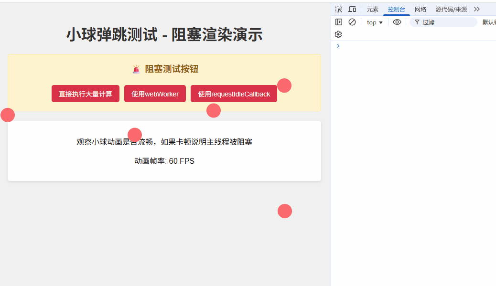
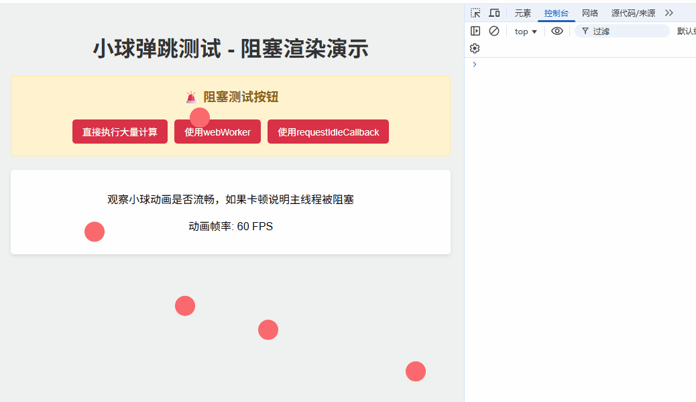

# 前言

从用户的角度评判一个网站的“优秀程度”，最直观的评价方式就是运行是否流畅，在页面渲染、交互时，是否会有卡顿感。

而造成视觉上卡顿的原因有很多，可能是：

1. 页面加载时一次性加载大量资源，导致用户等待页面绘制的时间过长。
2. script 标签使用不当，阻塞了 HTML 文档的解析与渲染。
3. 在页面运行时，执行繁重的 JS 计算，导致阻塞页面的渲染

本文将讨论第三点：繁重的 JS 运算是如何造成网页卡顿的，以及缓解卡顿的方式。

# 为什么网页会卡顿

网页卡顿，即页面元素的变化不流畅（甚至“卡住”），进行交互时有滞后感。

接下来将从**道理上**和**原理上**对`繁重JS运算导致页面卡顿`的原因进行理解。

## 道理上

JS 在设计之初的用途是操作 DOM 元素，而如果 JS 能在多个线程中执行，则代表 DOM 元素可能会同时被不同线程中的 JS 脚本进行操作，那么就可能出现冲突的情况。为了避免这种冲突的出现，**JS 在一开始就被设计成单线程语言**。在同一时间只能执行一个脚本，运行其中的一条语句。

但仅仅被设计为单线程还不足以解决 DOM 元素冲突的问题。

浏览器需要解析 HTML 中的 DOM 结构，并将其渲染至页面上。试想一下，**如果页面渲染和 JS 代码运行同时发生**，那么就有可能造成浏览器一边根据 DOM 渲染页面，JS 一边修改此 DOM，这就造成了冲突。所以浏览器被设计成：**页面渲染和 JS 执行互斥**，它俩不能同时执行。形成“页面渲染 - JS 修改 DOM - 页面渲染 - JS 修改 DON - ...”这种线性循环，完美的避免了冲突的问题。

上面的 JS 代码执行与页面渲染互斥的方案确实解决了两者冲突的问题，但同时也为页面卡顿留下了隐患：即在“页面渲染 - JS 修改 DOM”的循环过程中，如果 JS 需要执行长时间的任务，那么就会阻塞下一次页面的渲染，从而导致页面卡顿。这就是为什么从道理上说，繁重的 JS 运算可能会导致页面卡顿。

## 原理上

从原理上理解，可以归纳为一句话：`JS引擎长时间占用主线程，导致GUI渲染任务滞后`。

浏览器是一个多进程架构，可归纳为：

- 浏览器主进程
- GPU 进程
- 渲染进程
- 网络进程
- 插件进程

而其中的渲染进程是我们前端开发中最常接触到的一个进程，它可以理解为我们常说的“浏览器内核”，主要负责把 HTML、JS、CSS 解析呈现为可交互的页面。而浏览器中的一个 tab 页，就对应着一个渲染进程。

而在渲染进程中，有一个鼎鼎大名的线程，叫做`主线程`。在页面中，**JS 引擎解析执行代码**和**GUI 页面渲染任务**都是在此主线程中执行的，两者共享主线程，为互斥的关系。

所以如果某段 JS 代码执行需要消耗比较长的时间，长期占用主线程，那么就会导致页面渲染被阻塞，在用户的视角上看，就会觉得页面是一卡一卡的。

# 优化

接下来我们将构造一个繁重的 JS 任务，展示它对页面渲染的影响，然后尝试使用两种方案进行优化。

## 卡顿情况

假设我们有一个需求，就是需要进行一千万次循环计算，以模拟应用中的极端繁重运算。
具体代码如下所示

```javascript
function heavyCalculation() {
  let result = 0;
  // 进行一千万次计算
  for (let i = 0; i < 10000000; i++) {
    result += Math.sqrt(i) * Math.sin(i) * Math.cos(i) * Math.tan(i);
  }
}
```

当直接运行代码，会出现下图所示的卡顿情况：


其中的原因也非常明显，就是 JS 引擎长时间占据主线程，导致 GUI 渲染任务无法执行，所以跳动的小球就被定住了。直至计算任务完成，主线程才能执行 GUI 渲染任务，小球才会重新跳动。

## 解决方案

上述出现页面卡顿的原因是需要进行一千万次的循环，所需的时间太长了，而对于这个长耗时的任务，我们有两个方案去解决

1. 将一个耗时长的任务拆分成多个耗时较短的任务，并将它们分散在多个“执行 JS 代码 - 页面渲染”的循环中，每次 JS 引擎只执行部分任务，将足够多的时间留给 GUI 渲染页面。
2. 将繁重的 JS 任务放在独立于主线程的工作线程中执行，这样就不会阻塞 GUI 渲染页面了。

### 方案一：拆分任务，在空闲时间调用

我们可以手动将一个大型任务拆分成多个小型任务（如将一千万次循环任务，拆分成100个十万次循环任务）。然后使用 [requestIdleCallback](https://developer.mozilla.org/zh-CN/docs/Web/API/Window/requestIdleCallback) 帮我们执行拆分后的任务.

开始之前，先简单梳理一下 requestIdleCallback 的使用方式：requestIdleCallback 接收一个函数作为参数，并在`浏览器空闲的时候`调用此回调函数。

所谓的空闲时间，概念如下：

浏览器打开一个网页时，会循环地执行某些任务。并且根据页面刷新率的不同，每秒会执行 n 次循环（如果某个页面刷新率为 60hz，即每秒会执行 60 次循环，每个循环的时间为 1s / 60 = 16.7ms）,n 次循环称为 n 帧（fps），每一帧即是一次循环。

以 60 帧的页面为例，在每一帧(16.7ms)中，页面会按顺序执行如下任务：

1. 执行事件循环机制
2. 执行 requestAnimationFrame 回调
3. 渲染页面
4. （如有空闲时间）执行 requestIdleCallback 回调

一个真在运行的页面，就是不停地执行如上循环，以确保能正常地展示与交互。

requestIdleCallback 的执行时机，就是在某一帧中，当前三个任务执行完之后，如果还有剩余时间，则会运行 requestIdleCallback 的回调函数。

所以我们的思路如下：

1. 将繁重的 JS 任务拆分成多个小任务，放到自定义的任务队列中
2. 检查当前帧，是否有空闲时间：
   1. 有空闲时间：按顺序执行任务列表中的任务，直至此帧剩余时间消耗完毕
   2. 无空闲时间：在下一帧中检查是否有空闲时间

关键代码如下所示：
```javascript
// 任务列表（任务拆分及添加步骤省略）
const queue = [];

function handleQueue() {
  // 有空闲时间时，执行回调函数
  requestIdleCallback((idleDeadline) => {
    // 当任务列表有任务，且空闲时间大于2毫秒时，才执行任务列表
    while (queue.length && idleDeadline.timeRemaining() > 2) {
      const fn = queue.shift();
      fn();
    }
    // 再次调用，在下一次空闲时，判断并执行任务列表
    handleQueue();
  });
}

handleQueue();
```

上述代码只展示关键思路，对于任务的拆分可根据具体需求进行拆分并添加至任务列表中。且代码中判断空闲时间大于 2 毫秒时才执行下一个任务，这里也可根据具体情况进行调整，增大或减小边界时间。

优化后运行情况如下所示：


#### 优点
1. 代码运行在JS主线程中，能共享状态，无需考虑通信等问题
2. 只在浏览器空闲时间进行计算，运用恰当则不会影响应用性能

#### 缺点
1. 使用方式复杂，需编写任务队列，及处理任务函数
2. 需手动将繁重任务拆分为多个小任务，拆分不恰当还是可能阻塞页面渲染。
3. 遇到其他任务占用主线程时，可能浏览器长时间处于繁忙状态，没有空闲时间处理任务队列，导致任务队列中的任务执行时间推迟。


### 在工作线程中运行
除了将任务拆分后在主线程中运行，我们还可以让代码不在主线程中运行，直接“一劳永逸”，不会阻塞页面的渲染。

我们可以使用 [Worker](https://developer.mozilla.org/zh-CN/docs/Web/API/Worker) 构造函数，创建一个独立于主线程的工作线程，然后在此线程中运行繁重的 JS 运算。此工作线程代码的运行不会影响主线程，也就不会影响到页面的渲染了。

使用工作线程需注意的是，它与主线程是分隔开的，两者之间不能共享变量，需使用 [postMessage](https://developer.mozilla.org/zh-CN/docs/Web/API/Worker/postMessage) 和 [message 事件](https://developer.mozilla.org/zh-CN/docs/Web/API/Worker/message_event) 进行通信。

因为工作线程中代码的运行不会影响主线程，所以我们无需拆分任务，直接运行繁重的运算也是没问题的，代码如下所示：

主线程：
```javascript
// 创建工作线程
const worker = new Worker("./worker.js");

// 创建数据，并传递给工作线程
const data = {};
worker.postMessage(data);

// 监听工作线程回传信息
worker.addEventListener("message", (event) => {
  console.log(event.data);
});
```
工作线程 worker.js:
```javascript
// 繁重任务
function heavyCalculation(data) {}

// 监听message事件，并接收数据
self.addEventListener("message", (event) => {
  const data = event.data;
  // 直接运行繁重任务，不会影响主线程
  const res = heavyCalculation(data);

  // 将计算结果回传给主线程
  self.postMessage(res);
});
```
优化效果如图所示：


#### 优点
1. 独立的工作线程，不会阻塞JS主线程，不影响页面渲染。
2. 使用方式相对简单，使用 Worker 构造函数创建工作线程，直接编写同步的繁重计算代码，无需考虑线程阻塞问题。

#### 缺点
1. 主线程与工作线程状态不共享，需通过特殊API进行信息通信。
2. 需要手动管理已创建的工作线程，在不使用时执行销毁操作。

## 完整代码
两种方案的完整代码见 [github链接](https://github.com/lrhhaha/study-notes/tree/main/frontend/demo/%E5%A4%84%E7%90%86%E7%B9%81%E9%87%8D%E8%AE%A1%E7%AE%97%E4%BB%BB%E5%8A%A1/code2)。

# 总结
本文分析了运行繁重JS任务引起页面卡顿的原因为：JS引擎占用主线程，导致GUI渲染任务滞后。

然后尝试使用两种方案进行优化：
1. 将大型任务拆分为多个小型任务，借用 requestIdleCallback，在多个空闲帧中进行处理。
2. 使用 Worker 创建独立于主线程的工作线程，从根本上避免占用主线程的问题。