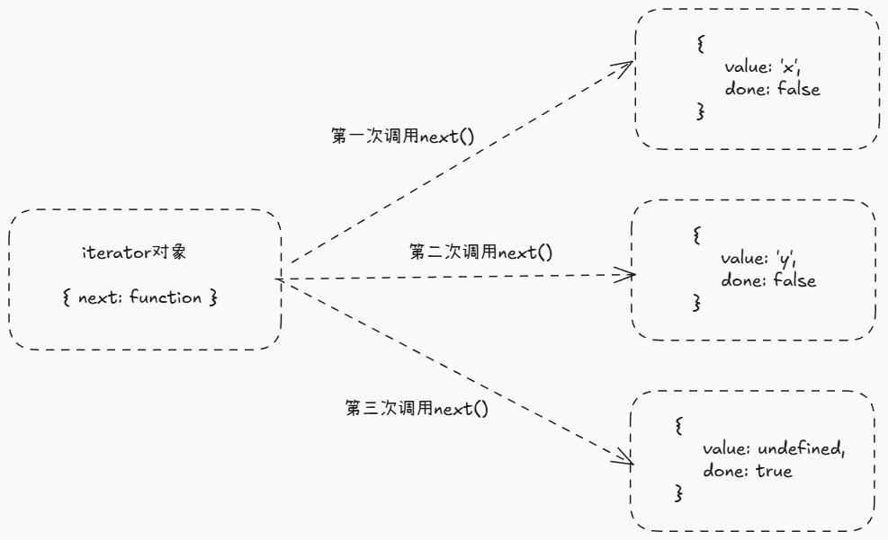

相信大家平时在编写代码遇到异步操作时，都喜欢使用 Promise，而遇到多个异步任务按顺序执行时，还会使用 async/await 语法简易地实现，而不必“忍受” Promise 长长的链式调用。

```javascript
async funtion fn() {
  const res1 = await queryData()
  const res2 = await asyncOperation(res1)
  handleData(res2)
}
```

那么 async/await 为何有那么大的能力能让我们的异步操作可以像同步代码一样书写呢？

本文将探究 async/await 的原理，并尝试手写实现 myAsyncAwait 函数。

# async/await 的前世今生

在 ECMAScript 2015（即 ES6）中，推出了三个语法：Iterator、Generator、Promise。

首先简短地总结它们推出的意义：

- [Iterator](https://developer.mozilla.org/zh-CN/docs/Web/JavaScript/Reference/Global_Objects/Iterator)（迭代器）：为各种不同的数据结构提供统一的访问机制。
- [Generator](https://developer.mozilla.org/zh-CN/docs/Web/JavaScript/Reference/Global_Objects/Generator)（生成器）：简化 Iterator 对象的生成。
- Promise: 异步操作解决方案（与 Iterator 及 Generator 不存在直接关系）。

后续有开发人员发现了 Generator + Promise 可以实现异步操作类似同步代码的书写方式，只不过需要手写"执行器"去辅助完成。[co.js](https://www.npmjs.com/package/co) 就是其中著名的代表。

后来这种 Generator + Promise 的异步流程控制方案得到了 ECMA 官方的认可，并着手制定一套名为 async/await 的语法，对传统 Generator + Promise 方案进行抽象，将其"执行器"内置，以便更方便地对异步操作进行同步化地书写。

在 ECMAScript 2017（即 ES8）正式发布 async/await 语法。这才有了我们今天简易的 async/await 写法。

所以 async/await 是 Generator + Promise `异步流程控制方案`的简易实现，或者说是其语法糖。它并非是异步操作解决方案。

本文将尝试使用 Generator 和 Promise 等相关知识，编写一个函数，以实现类似 async/await 的异步操作类似同步代码的书写方式。

# 前置知识

正式开始编写我们的 myAsyncAwait 函数之前，我们需要了解 Iterator 和 Generator 的相关知识。

## Iterator

ES6 中推出了 for...of 循环之后，我们可以使用其去遍历 Array、Map、Set 等数据结构，这些能使用 for...of 循环遍历的数据结构，我们称之为“可遍历的”。

其背后的奥秘就是，这些数据结构都能访问到 Symbol.iterator 属性，此属性是一个函数，执行之后会返回一个 Iterator 迭代器对象。而 for...of 循环正是通过消费 Iterator 迭代器对象来实现对某个数据结构的遍历操作（for...of 循环不关心此刻遍历的数据结构是怎么样的，只关心其是否部署了 Symbol.iterator 属性）。

> MDN：Iterator 对象是一个符合迭代器协议的对象，其提供了 next() 方法用以返回迭代器结果对象。

即所谓的 Iterator 迭代器对象是一个拥有 next()方法的对象，其 next()方法执行后会返回拥有 value 和 done 属性的对象。每次调用其 next()方法，都会返回一个拥有 value 和 done 属性的对象，直至其 done 属性值为 true。  
如下图所示：


for...of 循环正是调用了目标数据结构上的 Symbol.iterator 函数，得到了 Iterator 对象之后，反复调用其 next()函数，每次得到的 value 值就是本次迭代的值，直至 done 属性为 true，则结束循环。

基于上述描述，我们知道，只要一个数据结构正确地部署了 Symbol.iterator，就可以使用 for...of 对其进行循环遍历。接下来我们将为一个普通对象部署 Symbol.iterator 属性，看看其是否能使用 for...of 进行循环。

```javascript
const obj = {
  a: 1,
  b: 2,
};
// 普通对象不具备Symbol.iterator函数
console.log(obj[Symbol.iterator]); // undefined
try {
  for (let item of obj) {
    console.log(item);
  }
} catch (err) {
  console.log(err); // // Uncaught TypeError: {} is not iterable
}

// 编写一个函数，使其返回值是一个Iterator对象
function gen() {
  // 获取目标对象
  const obj = this;
  const arr = Object.entries(obj);
  let index = 0;
  function next() {
    if (index < arr.length) {
      return { value: arr[index++], done: false };
    } else {
      return { value: undefined, done: true };
    }
  }

  // 返回一个Iterator对象
  return {
    next,
  };
}

// 为此普通对象部署正确的Symbol.iterator函数
obj[Symbol.iterator] = gen;

// 可使用for...of循环
for (let item of obj) {
  console.log(item);
}
// [ 'a', 1 ]
// [ 'b', 2 ]
```

上述代码展示了，当我们为一个普通对象部署了 Symbol.iterator 函数之后，就变成了可迭代对象，就可以使用 for...of 进行循环了。

而事实上，Symbol.iterator 不仅能被 for...of 所消费，像扩展运算符、Array.from()等语法或函数其实都在消费 Symbol.iterator。

## Generator

上述为普通对象编写的返回 Iterator 对象的函数 gen，看起来不太简便，开发人员还需手动地构造 value 和 done 的值，稍显繁琐。

于是 Generator 函数就应运而生了，它被设计出来的目的就是：简化返回 Iterator 对象的函数的编写。它的返回值就是 Iterator 对象！

对于 Generator 生成器函数的详细描述，可移步阮一峰老师的 [ES6 入门教程](https://es6.ruanyifeng.com/#docs/generator)，本文只挑选相对重要的几点加以描述。

对于 Generator 函数，我们需要理解以下几点：

1. 函数调用后，不会执行里面的代码，而是返回一个 Iterator 对象。
2. 调用返回的 Iterator 对象的 next()方法后，Generator 函数体里的代码正式开始执行。
3. Generator 函数体代码在执行时，遇到 yield 关键字时停止执行，并将其后面表达式的值产出(作为 next 函数返回的对象中的 value 值)
4. yield 本身的返回值为 undefined。但当 Iterator 再次调用 next 方式时，可传入参数，这个参数将作为上一个 yield 的返回值。
5. 循环上述的 yield 暂停和 next 继续执行动作，直至 Generator 中的函数体执行 return 语句，return 值作为 next 方法返回对象的 value 值，done 为 true。

talk is cheep，show you the code：

```javascript
function* gen() {
  const res1 = yield 1;
  console.log(res1); // undefined

  const res2 = yield 2;
  console.log(res2); // '第2个yield得返回值'

  const res3 = yield 3;
  console.log(res2); // '第3个yield得返回值'

  return 999;
}

// 执行Generator函数，返回生成器对象
const iterator = gen();
iterator.next(); // { value: 1, done: false}
iterator.next(); // { value: 2, done: false}
iterator.next("第2个yield得返回值"); // { value: 3, done: false}
iterator.next("第3个yield得返回值"); // { value: 999, done: true}
```

由上述代码可以发现，使用 Generator 编写 Iterator 生成函数是非常直观的，yield 的值就是每次 next 方法返回的对象的 value 值。

# Promise + Generator 异步流程控制方案

Generator 生成器函数的特点就是“卡顿”，每次运行到 yield 语句时就会“卡住”，并且需要调用其返回的 Iterator 对象的 next 方法之后，才会继续往下执行，然后又在下一次 yield 处“卡住”。

那么我们是否可以在 yield 后紧跟一个异步操作，然后“监测”这个异步操作，当它完成了，我们才调用 Iterator 的 next 方法。这样的话，不就能实现异步操作的同步化编码了吗？
当然，为了让这个“异步操作的同步化编码”能更好与其他 JS 代码相结合，我们需要使用 Promise 与之合作，使整个控制方案是基于 Promise 的。

其实上述思想就是 Promise + Generator 异步流程控制方案的思想，也是前文提到的 co.js 库的思想，async/await 正是这种控制方案的简易使用版本。

接下来我们将基于 Promise + Generator 实现一套异步流程控制代码，其功能特点将与 async/await 基本看齐。

开始之前，我们先总结一下 async/await 的特点，然后制定 myAsyncAwait 函数的编写目标。

## async/await

```javascript
// 异步操作1
function p1() {
  return new Promise((resolve) => {
    setTimeout(() => {
      resolve("p1 resolve");
    }, 1000);
  });
}

// 异步操作2
function p2() {
  return new Promise((resolve, reject) => {
    setTimeout(() => {
      reject("p2 reject");
    }, 1000);
  });
}

async function fn() {
  // await的返回值为其后promise的兑现值
  const res1 = await p1();
  console.log("res1:", res1);

  // await后的表达式如果不是promise，将会被包裹为promise。
  const res2 = await 999;
  console.log("res2:", res2);

  try {
    // await后的promise状态为rejected的话，需要用tyr...catch处理
    const res3 = await p2();
  } catch (err) {
    // catch块中可获取到promise拒绝原因
    console.log("err:", err);
  }

  // async函数最终会返回一个promise，其return值就是promise的兑现值
  return "hello";
}

console.log("start");
// async执行后返回一个promise
fn().then((res) => {
  console.log("这是fn返回的promise：", res); // 'hello'
});
console.log("end");

// =========执行结果=========
// start
// end
// res1: p1 resolve
// res2: 999
// err: p2 reject
// 这是fn返回的promise： hello
```

特点：

1. await 后可跟任何值，如果不是 promise 值，将会创建一个 promise，并将其设置为兑现值。
2. await 的返回值是其后面的 promise 的兑现值，如果 promise 状态为 rejected，则报错，可使用 try...catch 捕获错误。
3. 整体代码从下往下按顺序执行，如 await 后是 promise，则等待其状态变化后，再往下执行（类似同步代码的效果）。
4. async 函数的返回值是一个 promise，它的兑现值是函数体中 return 语句表达式的值。

## myAsyncAwait

### 目标

我们的任务是，编写一个流程控制函数 myAsyncAwait，去执行 Generator 函数（Generator 函数体的书写方式，与 async 函数基本一致 ），使整个流程可以自动执行。

如下代码就是在 Generator 中编写异步代码，与前文的 async 函数基本一致。接下来我们将编写 myAsyncAwait 函数，让此 Generator 能自动执行，并符合前文提到的 async 函数的特点。

```javascript
// async => generator
function* fn() {
  // await => yield
  const res1 = yield p1();
  console.log("res1:", res1);

  const res2 = yield 999;
  console.log("res2:", res2);

  try {
    const res3 = yield p2();
  } catch (err) {
    console.log("err:", err);
  }

  return "hello";
}

console.log("start");
// fn() => myAsyncAwait(fn)
myAsyncAwait(fn).then((res) => {
  console.log("这是fn返回的promise：", res);
});
console.log("end");
```

### 具体实现

myAsyncAwait函数以Generator参数作为参数，并自动执行它。因为传进来的 Generator 函数，我们不知道它究竟会有多少个 yield“拦路”，所以只能一直调用其 Iterator 的 next 方法，判断返回对象的 done 属性，根据其值判断要结束循环，还是继续调用 next 方法。

我们需要一个 worker 函数，去帮我做以上判断，并作出对应操作：

1. worker 函数接受 next 方法的返回值作为参数（即拥有 value、done 属性的对象）
2. 判断 done 属性：
   1. done 为 true：结束
   2. done 为 false：
      1. 将 value 值包装为 promise
      2. 调用 promise.then 方法，等待异步操作完成。取出其兑现值，再次调用 next 方法，并将兑现值作为参数传入，将返回值作为参数递归调用 worker
      3. 如 promise 状态为 rejected，则调用 iterator.throw 方法，将拒绝原因抛出，继续递归调用 worker 方法。

```javascript
function worker(item) {
  // 如果done为true，则无需往后执行
  if (item.done) {
    return;
  }

  // 如果obj.value本来就是promise，那么直接返回它，否则创建一个promise，并以obj.value作为兑现值
  const p = Promise.resolve(item.value);
  let nextItem;

  // 调用promise.then等待异步操作完成
  p.then((res) => {
    // 继续调用next方法，让yield“放行”，res参数将作为上一个yield的返回值！
    nextItem = iterator.next(res);
    // 将next返回值作为参数递归调用，判断是否需要继续递归执行
    worker(nextItem);
  }).catch((err) => {
    // 其实throw等于执行了next并抛出了错误（甚至可以理解为“使用next返回了一个错误”）
    nextItem = iterator.throw(err);
    worker(nextItem);
  });
}
```

上述代码完成了递归判断**是否需要继续调用 next 方法**的功能，但它接受的参数是 next 方法的返回值，所以我们需要将它嵌套在我们的 myAsyncAwait 函数中执行。

```javascript
function myAsyncAwait(generator) {
  // 获取迭代器
  const iterator = generator();
  // 调用next方法，执行Generator函数体代码
  let res = iterator.next();
  // 调用worker，交由其判断后续行为
  worker(res);

  function worker(item) {
    if (item.done) {
      return;
    }

    const p = Promise.resolve(item.value);
    let nextItem;

    p.then((res) => {
      nextItem = iterator.next(res);
      worker(nextItem);
    }).catch((err) => {
      nextItem = iterator.throw(err);
      worker(nextItem);
    });
  }
}
```

上述代码已经完成了 myAsyncAwait 的 暂停等待异步操作完成 -> 继续执行代码 的功能了，接下来的最后一个就是让 myAsyncAwait 像 async 函数一样，返回值是 promise 对象。

我们需要的就是直接让 myAsyncAwait 返回一个 new Promise 对象，至于其 resolve 方法，当然就是在 next 方法返回的对象的 done 属性为 true 时调用，并且将其 value 值作为兑现值。

```javascript
function myAsyncAwait(generator) {
  // myAsyncAwait的返回值是一个Promise对象
  return new Promise((resolve) => {
    const iterator = generator();

    let res = iterator.next();
    worker(res);

    function worker(item) {
      if (item.done) {
        // 将Generator的返回值作为promise的兑现值
        resolve(item.value);
        return;
      }

      const p = Promise.resolve(item.value);
      let nextItem;
      p.then((res) => {
        nextItem = iterator.next(res);
        worker(nextItem);
      }).catch((err) => {
        nextItem = iterator.throw(err);
        worker(nextItem);
      });
    }
  });
}
```

至此，myAsyncAwait 方法已经编写完毕，它就是一个合格的 Generator + Promise 异步流程控制方案的执行器，也就是 async/await 的实现原理。
### 测试用例
测试代码如下所示，可以看到使用 Generator + Promise 的书写方式，与 async/await 的书写方式是“一致”的，并且最终执行表现也是一致的。

```javascript
// 异步操作1
function p1() {
  return new Promise((resolve) => {
    setTimeout(() => {
      resolve("p1 resolve");
    }, 1000);
  });
}

// 异步操作2
function p2() {
  return new Promise((resolve, reject) => {
    setTimeout(() => {
      reject("p2 reject");
    }, 1000);
  });
}

// Generator + Promise控制器函数
function myAsyncAwait(generator) {
  return new Promise((resolve) => {
    const iterator = generator();

    let res = iterator.next();
    worker(res);

    function worker(item) {
      if (item.done) {
        resolve(item.value);
        return;
      }

      const p = Promise.resolve(item.value);
      let nextItem;
      p.then((res) => {
        nextItem = iterator.next(res);
        worker(nextItem);
      }).catch((err) => {
        nextItem = iterator.throw(err);
        worker(nextItem);
      });
    }
  });
}

// async/await 书写方式
async function fn1() {
  const res1 = await p1();
  console.log("res1:", res1);

  const res2 = await 999;
  console.log("res2:", res2);

  try {
    const res3 = await p2();
  } catch (err) {
    console.log("err:", err);
  }

  return "hello";
}

// Generator + Promise 书写方式
function* fn2() {
  const res1 = yield p1();
  console.log("res1:", res1);

  const res2 = yield 999;
  console.log("res2:", res2);

  try {
    const res3 = yield p2();
  } catch (err) {
    console.log("err:", err);
  }

  return "hello";
}

// ==========运行时先注释下面Generator代码，避免混淆================
console.log("start");
fn1().then((res) => {
  console.log("这是fn1返回的promise：", res);
});
console.log("end");
// =========执行结果=========
// start
// end
// res1: p1 resolve
// res2: 999
// err: p2 reject
// 这是fn1返回的promise： hello

// ==========运行时先注释上面async代码，避免混淆================
console.log("start");
myAsyncAwait(fn2).then((res) => {
  console.log("这是fn2返回的promise：", res);
});
console.log("end");
// =========执行结果=========
// start
// end
// res1: p1 resolve
// res2: 999
// err: p2 reject
// 这是fn2返回的promise： hello
```

# 总结

如上内容就是对 async/await 原理的模拟实现，但这么说似乎有点“倒反天罡”。\
因为 Generator + Promise 的异步流程控制方案早在 ECMAScript 2015 的语法中就可实现了，而 ECMAScript 2017 中的 async/await 只是对这个方案进行了抽象，使代码编写更加简易。\
所以文本实现的 myAsyncAwait 方法，也可视为 Generator + Promise 方案的执行器，更像一个简化版的 co.js。
