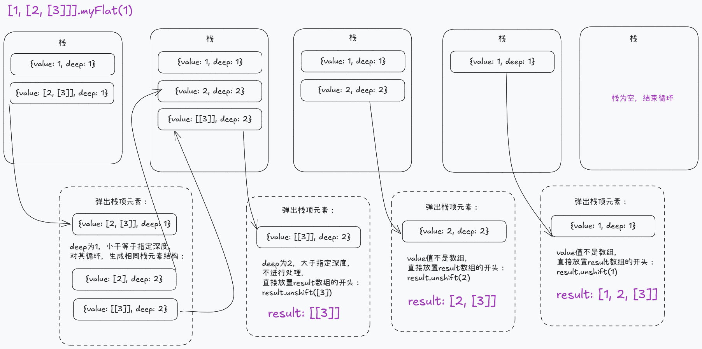

在日常学习与工作中，对数组进行扁平化是常见的操作。文本将尝试编写函数以实现数组扁平化的功能。

所谓扁平化，即递归地将数组中嵌套的数组的元素提取出来，返回无内嵌子数组的数组。具体表现如下所示：

```javascript
const arr = [0, 1, [2, [3, [4, 5]]]];
// 深度扁平化后形如：[0, 1, 2, 3, 4, 5]
```

# 前置知识

## Array.prototype.flat

在 JS 中要实现数组扁平化操作，其实已有原生方法 [flat](https://developer.mozilla.org/zh-CN/docs/Web/JavaScript/Reference/Global_Objects/Array/flat) 函数，所以我们先探究一下原生 flat 函数的特点，然后再尝试复刻我们自己的 myFlat 方法。

查阅 MDN 文档可知，flat 方法定义的特点如下：

- 参数
  - depth（可选）：指定扁平化的深度，默认值为 1.
- 返回值
  - 扁平化后的新数组

具体使用例子

```javascript
// 存放在Array.prototype中
console.log(Array.prototype.flat === [].flat); // true

// 不改变原数组
const arr1 = [0, [1]];
console.log(arr1 === arr1.flat()); //false

// 默认值为1
console.log([0, [1, 2]].flat()); // [0, 1, 2]
// 参数向下取整
console.log([0, [1, 2, [3]]].flat(1.8)); // [0, 1, 2, [3]]

// 对参数进行向下取整，小于1时不执行扁平化操作
console.log([0, [1, 2]].flat(0.9)); // [0, [1, 2]]
console.log([0, [1, 2]].flat(0)); // [0, [1, 2]]
console.log([0, [1, 2]].flat(-1)); // [0, [1, 2]]

// 参数类型为非number时， 装成number，NaN视为0
console.log([0, [1, 2]].flat("a")); // [0, [1, 2]]
console.log([0, [1, 2]].flat("1")); // [0, 1, 2]

// 扁平化过程中删除稀松数组的空槽
console.log([1, , 3, ["a", , "c"]].flat()); // [ 1, 3, "a", "c" ]
```

可见 flat 方法的特点如下：

1. 存放在 Array.prototype 中
2. 不修改原数组，返回值为扁平化后的新数组
3. 参数默认值为 1
4. 对参数进行类型转换，NaN 视为 0，对非 NaN 的 number 值进行向下取整，小于 1 时不执行扁平化操作
5. 扁平化过程中删除稀松数组的空槽

## 稀松数组

上面提到了稀松数组及其空槽的概念，这里延申聊一下。

> 空槽：数组中的空槽表示此索引在数组中不存在（但同时 JS 规定了访问数组不存在的索引时返回 undefined）。

而空槽存在的意义是创建数组时不需要初始化每个位置，避免不必要的内存分配。

一般情况下，会有两种常见的方式创建稀松数组，如下所示

```javascript
// 数组字面量
const arr1 = [1, , 2];
console.log(arr1); // [1, <1 empty item>, 2]

// 构造函数
const arr2 = new Array(3);
console.log(arr2); // [<3 empty item>]

console.log(arr2[0] === undefined); // undefined
```

而分辨数组中某项是否为空槽，可以使用如下方法：

```javascript
const arr = [1, , 2];
console.log(arr.hasOwnProperty(2)); // false
console.log(1 in arr); // false
console.log(Object.hasOwn(arr, 1)); // false
```

# 具体实现

## 需求分析

我们将要实现的扁平化函数，将符合上述提到的原生 flat 的特点：

1. 存放在 Array.prototype 中
2. 不修改原数组，返回值为扁平化后的新数组
3. 参数默认值为 1
4. 对参数进行类型转换，NaN 视为 0，对非 NaN 的 number 值进行向下取整，小于 1 时不执行扁平化操作
5. 扁平化过程中删除稀松数组的空槽

## 基础思路
后续将展示3个版本的实现，它们将使用不同的语法进行实现，但基本逻辑是一致的：

1. 对参数进行处理，如处理后的值小于1，则返回浅拷贝数组，否则进行扁平化流程
2. 遍历数组，跳过空槽，判断当前元素是否为数组且深度是否符合参数指定的处理深度：
   1. 不符合：将当前元素作为最终形态存入 result 数组
   2. 递归调用扁平化函数，参数深度减一

## ES5 实现
本小节将使用ES5的方式实现，实现思路与上述思路是一致的

主要逻辑为：
1. 循环遍历整个数组
2. 判断是否为稀松项，是的话跳过此次迭代
3. 判断当前深度是否符合指定深度，以及元素是否为数组
4. 如有需要，递归扁平化此数组，否则将其作为数组元素存入

```javascript
Array.prototype.myFlat = function (depth) {
  //  获取当前数组
  const array = this;

  // 参数默认值为1
  depth = depth === undefined ? 1 : depth;
  // 类型转换，结果可能是常规数字，或者是NaN
  depth = Number(depth);
  // NaN视为0，其余正常数字向下取整
  depth = NaN.isNaN(depth) ? 0 : Math.floor(depth);

  // depth小于1，不进行扁平化处理，直接返回浅拷贝数组
  if (depth < 1) return array.slice();

  // 返回值
  const result = [];

  for (let i = 0; i < array.length; i++) {
    // 过滤稀松项
    if (!array.hasOwnProperty(i)) {
      // 跳过此次迭代
      continue;
    }

    const item = array[i];

    if (depth > 0 && Array.isArray(item)) {
      // 递归调用，返回值是一个扁平化后的数组
      const newArr = item.myFlat(depth - 1);
      // 将扁平化好的数组元素合并到最终数组中
      result = result.concat(newArr);
    } else {
      // 不是数组，或深度不符合参数指定深度，直接将元素作为结果存入
      result.push(item);
    }
  }

  return result;
};

const array = [1, , 2, undefined, [3, [4, [5, 6]]]];
console.log(array.myFlat()); // [ 1, 2, undefined, 3, [ 4, [ 5, 6 ] ] ]
console.log(array.myFlat(2)); // [ 1, 2, undefined, 3, 4, [ 5, 6 ] ]
console.log(array.myFlat(Infinity)); // [ 1, 2, undefined, 3, 4, 5, 6 ]
```

## ES6 实现

此小节的将使用ES6的方式实现，实现逻辑和 ES5 的完全一样，只不过会在默认值，合并数组等方面使用 ES6 的新特性。

```javascript
Array.prototype.myFlat = function (depth = 1) {
  const array = this;
  const result = [];

  for (let i = 0; i < array.length; i++) {
    // 过滤稀疏数项
    if (!Object.hasOwn(array, i)) {
      continue;
    }

    const item = array[i];

    if (depth > 0 && Array.isArray(item)) {
      // 返回值是一个扁平化后的数组
      const newArr = item.myFlat(depth - 1);
      result.push(...newArr);
    } else {
      result.push(item);
    }
  }

  return result;
};

const array = [1, , 2, undefined, [3, [4, [5, 6]]]];
console.log(array.myFlat()); // [ 1, 2, undefined, 3, [ 4, [ 5, 6 ] ] ]
console.log(array.myFlat(2)); // [ 1, 2, undefined, 3, 4, [ 5, 6 ] ]
console.log(array.myFlat(Infinity)); // [ 1, 2, undefined, 3, 4, 5, 6 ]
```

## reduce 版本
使用 reduce 函数，利用函数式编程，使整体代码更加简洁。核心思想仍是递归。

值得一提的是，使用Array.prototype.reduce方法，在对数组进行遍历的过程会，会自动跳过空槽，无需我们手动处理

```javascript
Array.prototype.myFlat = function (depth = 1) {
  const array = this;

  return array.reduce((acc, curr, index) => {
    if (depth > 0 && Array.isArray(curr)) {
      return acc.concat(curr.myFlat(depth - 1));
    } else {
      acc.push(curr);
      return acc;
    }
  }, []);
};

const array = [1, , 2, undefined, [3, [4, [5, 6]]]];
console.log(array.myFlat()); // [ 1, 2, undefined, 3, [ 4, [ 5, 6 ] ] ]
console.log(array.myFlat(2)); // [ 1, 2, undefined, 3, 4, [ 5, 6 ] ]
console.log(array.myFlat(Infinity)); // [ 1, 2, undefined, 3, 4, 5, 6 ]
```


## 栈结构迭代实现

上述实现方式的核心都使用了递归的方式，当递归次数过多时，可能会出现调用栈溢出的问题。为了避免这个问题，可借用栈结构，配合迭代实现。

主要逻辑为：

1. 首先需要构造如下数据结构：

```javascript
const arr = [1, [2, [3]]];

// stack结构如下所示：
// [
//   {
//     value:1,
//     deep: 1, // 当前元素在原数组中的深度
//   },
//   {
//     value: [2, [3]],
//     deep: 1
//   }
// ]
```

2. 然后从栈中弹出元素进行处理，如果 value 是非数组，则直接存放到 result 中。
3. 如果 value 是数组，则判断其深度是否符合函数参数要求：
   1. 符合，则遍历其元素生成相同的栈结构，并 push 进栈中，以便在后续迭代中处理。
   2. 不符合，直接作为结果，存放至 result 中
4. 重复步骤二、三，直至清空 stack

talk is cheap, show you the picture：




picture is cheap too, show you the code：

```javascript
Array.prototype.myFlat = function (depth = 1) {
  const array = this;
  const result = [];

  const stack = array
    .filter(() => true) // 过滤稀松项
    .map((item) => ({ value: item, deep: 1 })); // 构造栈结构

  // 对栈进行迭代，直至其为空
  while (stack.length > 0) {
    const item = stack.pop();

    if (Array.isArray(item.value) && depth >= item.deep) {
      // 元素是数组，且深度符合处理要求

      // 对此数组的元素进行处理，生成栈元素结构，并push进栈
      const newStack = item.value
        .filter(() => true) // 过滤稀松项
        .map((element) => ({
          value: element,
          deep: item.deep + 1,
        }));
      stack.push(...newStack);
    } else {
      result.unshift(item.value);
    }
  }

  return result;
};

const array = [1, , 2, undefined, [3, [4, [5, 6]]]];
console.log(array.myFlat()); // [ 1, 2, undefined, 3, [ 4, [ 5, 6 ] ] ]
console.log(array.myFlat(2)); // [ 1, 2, undefined, 3, 4, [ 5, 6 ] ]
console.log(array.myFlat(Infinity)); // [ 1, 2, undefined, 3, 4, 5, 6 ]
```


## spread 版本

最后附送一个简易的深度扁平化版本——spread版。

但 spread 版本其实是不支持指定扁平化深度的，只能实现完全扁平化。且没有使用递归方式，能避免调用栈溢出的问题。

主要原理是利用 concat 和扩展运算符的结合，使单层数组的元素会被抽离出来，合并到新数组中，如此往复，直至数组中没有嵌套的数组。

值得注意的是，使用扩展运算符，会直接将稀松项转化为 undefined。所以每次使用扩展运算符之前，需要先将稀松项过滤掉（可使用filter方法简单实现）。具体表现如下：

```javascript
console.log([...[1, , 2]]); // [1, undefined, 2]

console.log([1, ,2].filter(() => true)) // [1, 2]
```

具体代码如下：

```javascript
Array.prototype.myFlat = function () {
  const array = this;
  let result = array.filter(() => true);

  // 只要当前数组的直接子元素存在数组，则进行处理
  while (result.some((item) => Array.isArray(item))) {
    result = [].concat(...result);
    // 将数组中的稀松项过滤掉，不让其经过下次扩展运算符或直接返回
    result = result.filter(() => true);
  }
  return result;
};

const array = [1, , 2, undefined, [3, [4, [5, 6]]]];
console.log(array.myFlat()); // [ 1, 2, undefined, 3, 4, 5, 6 ]
```

# 总结
本文实现了多个数组扁平化函数，但归根结底，其实就是两种方案的不同实现方式而已：
1. 循环遍历，递归实现
2. 借用栈结构的迭代实现

递归方案更符合直觉，也能解决日常绝大部分需求，但为了避免出现调用栈溢出的问题，使用栈结构的迭代方案则更为保险。