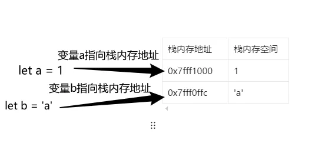
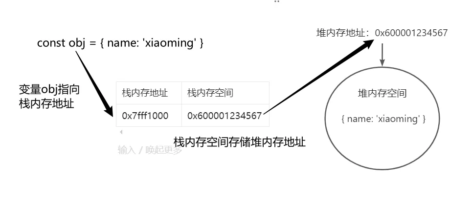

# 零、栈内存与堆内存

在 JS 中，存储空间可分为栈内存与堆内存，可以简单理解为：原始值存放在栈内存中，引用值存放在堆内存中。

## 原始值与栈内存

当我们声明一个变量，赋值为原始值的时候，JS 引擎会开辟一个栈内存空间，把原始值存放在栈内存空间中，并且使变量指向这个栈内存空间的地址。  
当我们读取这个变量的时候，其实就是读取这个变量所对应的栈内存中的值。示意图如下所示：



## 引用值与堆内存

而对于引用值，当我们声明一个变量为引用值的时候，同样会开辟一个栈内存空间，并且这个变量同样指向栈内存的地址，但是这个变量实际上是存放在堆内存中的，而栈内存空间存放的是堆内存的空间。  
当我们使用变量读取某个引用值的时候，会首先通过栈内存地址找到栈内存空间，然后通过里面存放的堆内存地址，找到真正存放引用值的堆内存空间，从而读取引用值具体的值，示意图如下所示：


# 浅拷贝

所谓的浅拷贝，就是把栈内存空间的值直接复制一份，如果存放的是原始值，则毫无疑问地复制它的值，如果存放的是引用值（即堆内存地址），那么也是直接将堆内存地址复制下来。

所以浅拷贝有个显而易见的问题，就是拷贝引用值的时候，只抄下了它的门牌号，并没有对家里的东西进行复制，所以如果在原对象中对引用值进行修改，那么浅拷贝后的对象中所对应的引用值也会受影响（因为浅拷贝只拷贝了门牌号，最终访问的还是同一个家）。

理解了浅拷贝的含义后，将尝试手写一个浅拷贝函数，并作出如下约定：

1. 只对数组和对象进行处理
2. 只对自身且可枚举的属性进行拷贝
3. 不处理 symbol 属性

```javascript
function clone(origin) {
  if (origin instanceof Array) {
    // 处理数组的情况

    // 展示两种简易的方法
    // return origin.slice()
    // return [...origin];

    // 创建一个与原数组同样长度的数组
    const result = new Array(origin.length).fill(0);

    origin.forEach((item, index) => {
      result[index] = item;
    });
    return result;
  } else if (Object.prototype.toString.call(origin) === "[object Object]") {
    // 处理对象的情况

    // 展示两种简易的浅拷贝方法
    // return { ...origin }
    // return Object.assign({}, origin)

    const result = {};

    // 遍历自身及原型链上的可枚举属性
    for (let key in origin) {
      // 是自身属性才进行克隆
      if (Object.hasOwn(origin, key)) {
        result[key] = origin[key];
      }
    }

    // 注：以下是对symbol属性进行处理，一般无需使用到，可根据业务进行调整
    // 获取自身所有symbol属性（包括不可枚举的）
    // const symbolKeys = Object.getOwnPropertySymbols(origin);
    // // 判断属性的可枚举性
    // for (let key of symbolKeys) {
    //   const descriptor = Reflect.getOwnPropertyDescriptor(origin, key)
    //   // 是可枚举属性才进行克隆
    //   if (descriptor.enumerable) {
    //     result[key] = origin[key]
    //   }
    // }

    return result;
  }

  // 其他情况如原始值，或Function等内置对象直接返回。
  return origin;
}
```

# 深拷贝

          


```javascript
function deepClone(origin, visited = new WeakMap()) {
  // 原始值直接返回, 函数不作处理，直接返回
  if (origin === null || typeof origin !== "object") return origin;

  if (visited.has(origin)) return visited.get(origin);

  // 某些内置对象，这里只举几个例子
  if (origin instanceof Date) return new Date(origin);
  if (origin instanceof RegExp) return new RegExp(origin);
  if (origin instanceof Map) return new Map(origin);
  if (origin instanceof Set) return new Set(origin);

  // 处理数组
  if (origin instanceof Array) {
    const result = [];
    visited.set(origin, result);

    origin.forEach((item, index) => {
      result[index] = deepClone(item);
    });
    return result;
  }

  // 处理对象
  if (Object.prototype.toString.call(origin) === "[object Object]") {
    const result = {};
    visited.set(origin, result);

    for (let key in origin) {
      if (Object.hasOwn(origin, key)) {
        result[key] = deepClone(origin[key]);
      }
    }
    return result;
  }

  // 更多未处理的内置对象，暂不处理，直接返回
  return origin;
}
```
