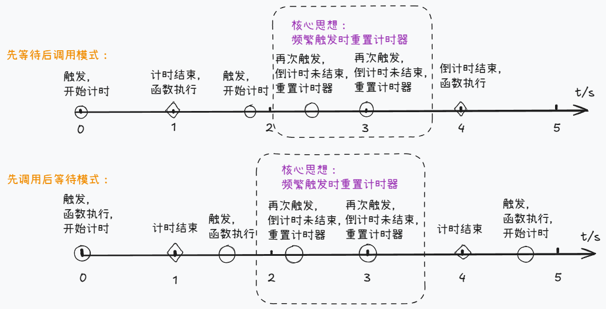
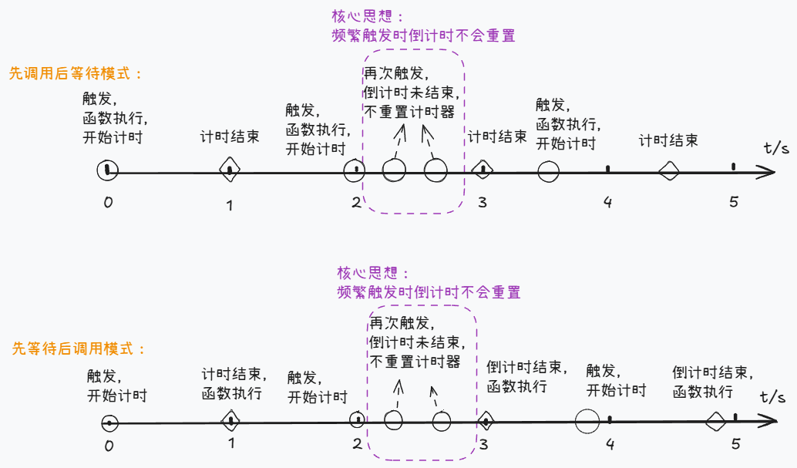

今天我们来聊聊网页性能优化的其中两个手段——防抖/节流。它们功能相近，经常会被一起提及，但却又有不同的适用场景。

接下来我们将从概念开始理解，并逐步尝试手写实现。

# 概念

所谓的防抖和节流，其实是函数的一种特性，分别可以描述为：

> 防抖：一个具有防抖特性的函数被触发时，它将等待特定时间后“执行”，但如果在等待期间被再次触发，则重新计时。

> 节流：一个具有节流特性的函数被触发并运行后，会开始倒计时，在倒计时结束前无法再次被触发运行。

两者的区别可以描述为：

> 在等待时期，如果函数被触发：
>
> 1. 防抖：重置计时器
> 2. 节流：不会重置计时器

然后在上面的基础思想上，一般还会分为两个版本：

1. 第一次触发函数的时候，将等待特定时间后再执行函数
2. 第一次触发函数的时候，立即执行函数，然后开始倒计时

即：**先调用后等待** 还是 **先等待后调用**。

上述两个版本都是正确的，它们都遵循防抖和节流的核心思想，只是在第一次触发函数时的行为会有所差异

具体情况如下图所示：

防抖：  
先无需纠结于等待与调用的先后顺序，将关注点放在虚线框中的核心思想中，两种模式的核心思想是一致的，这才是防抖最根本的东西


节流：  
同样地，应先将焦点放在核心思想上，再去理解等待与调用的先后顺序之分


值得一提的是：
我们平常说的“防抖函数”，通常指的是“能返回具有防抖特性函数的函数”。也就是说所谓的防抖函数是一个高阶函数，它本身并不具有防抖的特性，而是经过它包装之后，所返回的函数具有防抖特性。同理，“节流函数”也是如此。

# 具体实现

## 防抖

### 基础实现

上面提到了防抖拥有两个版本：**先调用后等待** 和 **先等待后调用**。我们将使用 leading 参数来区别，约定如下：

1. leading 为 false 时，是**先等待后调用**。为 true 则是**先调用后等待**。
2. leading 默认值为 false。

然后，为了实现在等待时间内重复调用函数时，会重新计时的特点，需要借助闭包的特点，在父级函数中定义变量，使返回出去的闭包函数在每次运行时，都能访问到同一个变量（再去做相应的逻辑判断），而不是重新生成局部变量（这样无法在多次调用时共享状态）。

具体实现如下所示：

```javascript
function debounce(fn, delay, leading = false) {
  // 在父级函数中定义，使返回的闭包函数在多次调用时，能访问到同一个变量
  let timer = null;

  function worker(...args) {
    if (leading) {
      // 先调用后等待模式

      // 倒计时已经结束，立即调用函数
      if (!timer) {
        fn.apply(this, args);
      }
      // 清除上一次可能存在的延时器
      timer && clearTimeout(timer);
      // 重置倒计时
      timer = setTimeout(() => {
        // 重置标志位，使下次调用时能立即执行函数
        timer = null;
      }, delay);
    } else {
      // 先等待后调用模式

      // 每次执行函数时，清除上一次可能存在的延时器
      timer && clearTimeout(timer);

      // 函数每次被触发时，都重新开始计时
      timer = setTimeout(() => {
        // this绑定为闭包函数运行时的this指向
        fn.apply(this, args);
      }, delay);
    }
  }

  return worker;
}
```

上述函数中，leading 为 false 时，能保证函数 fn 的 this 能正确绑定，原因如下：  
回调函数使用箭头函数，而箭头函数被声明的时间是在 setTimeout 执行的瞬间（或者说前一刻），此刻箭头函数的 this 指向会继承上层作用域的 this 指向，也就是返回出去的闭包函数的 this 指向。所以防抖函数返回出去的“真正的防抖函数”是可以按照需求绑定 this 指向的。

如使用普通函数，那么应该修改为：

```javascript
function debounce(fn, delay, leading = false) {
  let timer = null;

  function worker(...args) {
    // 函数被调用时，保存其this指向
    const that = this;

    if (leading) {
      // 先调用后等待模式
      // some code...
    } else {
      // 先等待后调用模式

      timer && clearTimeout(timer);
      timer = setTimeout(function () {
        // console.log(this) // 非严格模式：window ; 严格模式: undefined
        fn.apply(that, args);
      }, delay);
    }
  }
  return worker;
}
```

### 进阶实现

上一小节，已经实现了防抖函数两个模式的基础代码了。

这一小节我们将为返回的 worker 函数增加两个小功能：取消延迟函数的调用 和 立即调用延迟函数。

这两个功能函数将作为返回的 worker 函数的属性。

#### 取消延迟函数的调用

我们希望会有这么一个 cancel 函数：当调用它的时候，可以取消倒计时结束后函数的调用（如果存在的话），并且重置延时器的倒计时，使下一次调用返回出去的 worker 函数的时候，就像是“第一次调用”那样。

```javascript
function debounce(fn, delay, leading = false) {
  let timer = null;

  function worker(...args) {
    if (leading) {
      // 先调用后等待模式

      if (!timer) {
        fn.apply(this, args);
      }

      timer && clearTimeout(timer);
      timer = setTimeout(() => {
        timer = null;
      }, delay);
    } else {
      // 先等待后调用模式

      timer && clearTimeout(timer);
      timer = setTimeout(() => {
        fn.apply(this, args);
      }, delay);
    }
  }

  function cancel() {
    // 清除延时器，阻止后续的函数执行
    clearTimeout(timer);
    // 重置防抖函数标志位
    timer = null;
  }

  worker.cancel = cancel;

  return worker;
}
```

#### 立即调用延迟函数

如果此时延时器正在倒计时准备调用延迟函数，那么可以调用 worker 的 flush 方法，以便立即调用此延迟函数，并重置防抖函数的标志位。

主要思路：

1. flush 函数中需立即调用 fn.apply(this, args)，所以需要使 flush 函数能访问到 worker 函数的实参及 this 指向。
2. 借助 cancel 函数，将防抖函数的标志位重置。

为了使 flush 函数能访问到 worker 函数的实参及 this 指向，我们需要在它们的父级作用域中创建变量，然后在 worker 每次被调用时，将实参及 this 保存下来。

```javascript
function debounce(fn, delay, leading = false) {
  let timer = null;

  // 用于保存this指向
  let that = null;
  // 用于保存实参列表
  let argList = null;

  function worker(...args) {
    // 保存this指向
    that = this;
    // 保存实参列表
    argList = args;

    if (leading) {
      // 先调用后等待模式

      if (!timer) {
        fn.apply(this, args);
      }
      // 清空this指向，防止 flush 函数被错误执行
      that = null;
      timer && clearTimeout(timer);
      timer = setTimeout(() => {
        // 调用cancel函数，重置标志位
        cancel();
      }, delay);
    } else {
      // 先等待后调用模式

      timer && clearTimeout(timer);
      timer = setTimeout(() => {
        fn.apply(this, args);
        // 调用cancel函数，重置标志位
        cancel();
      }, delay);
    }
  }

  function cancel() {
    clearTimeout(timer);
    timer = null;
    // 清空this指向
    that = null;
    // 清空参数列表
    argList = null;
  }

  function flush() {
    // 判断是否有延迟函数需要执行
    if (!that) return;

    // 立即执行延迟函数
    const result = fn.apply(that, argList);
    // 重置标志位
    cancel();

    return result;
  }

  worker.cancel = cancel;
  worker.flush = flush;

  return worker;
}
```

### 应用场景

防抖函数的使用场景可简单理解为：在某些快速触发事件的场景下，希望在整个频繁触发的过程中都不运行函数，如：

1. 表单的校验：当用户快速输入内容时，在整个输入期间都不对内容进行校验，只在停止输入后进行一次校验。
2. window 的 resize 事件监听函数中，避免窗口在变动时频繁触发昂贵的计算开销。

然后具体是选择**先调用后等待模式**还是**先等待后调用模式**，则需要根据实际业务需求进行选择。

## 节流

节流函数的实现和防抖函数有很多共同之处，我们需要捉住最重要的概念：**节流函数在频繁触发时不会重置倒计时，只会阻止回调函数的执行**。

### 基础实现

与防抖函数一样，节流函数也是支持**先调用后等待**和**先等待后调用**这两种模式。

它们大部分的逻辑都是相似的，在此就不再赘叙。

稍有不同的地方在于，我们将遵循 lodash 库的默认形式，节流函数的 leading 配置项将会是 true。

```javascript
function throttle(fn, delay, leading) {
  let timer = null;

  function worker(...args) {
    if (timer === null) {
      leading && fn.apply(this, args);

      timer = setTimeout(() => {
        leading || fn.apply(this, args);
        timer = null;
      }, delay);
    }
  }

  return worker;
}
```

### 进阶实现

接下来，我们也为节流函数增加 取消延迟函数的调用 和 立即调用延迟函数，这两个功能。

#### 取消延迟函数的调用

我们希望会有这么一个 cancel 函数：当调用它的时候，可以取消倒计时结束后函数的调用（如果存在的话），并且重置延时器的倒计时，使下一次调用返回出去的 worker 函数的时候，就像是“第一次调用”那样。

```javascript
function throttle(fn, delay, leading) {
  let timer = null;

  function worker(...args) {
    if (timer === null) {
      leading && fn.apply(this, args);

      timer = setTimeout(() => {
        leading || fn.apply(this, args);

        // 倒计时结束，重置标志位
        timer = null;
      }, delay);
    }
  }

  function cancel() {
    timer && clearTimeout(timer);
    timer = null;
  }

  worker.cancel = cancel;

  return worker;
}
```

#### 立即调用延迟函数

与防抖函数的 flush 方法一样，重点在于保存 worker 函数的实参及 this 指向。

```javascript
function throttle(fn, delay, leading) {
  let timer = null;

  // 用于保存this指向
  let that = null;
  // 用于保存实参列表
  let argList = null;

  function worker(...args) {
    // 保存this指向
    that = this;
    // 保存实参列表
    argList = args;

    if (timer === null) {
      if (leading) {
        fn.apply(this, args);
        that = null;
      }

      timer = setTimeout(() => {
        leading || fn.apply(this, args);
        cancel();
      }, delay);
    }
  }

  function cancel() {
    timer && clearTimeout(timer);
    timer = null;

    // 清除this指向
    that = null;
    // 清除参数列表
    argList = null;
  }

  function flush() {
    if (!that) return;

    const result = fn.apply(that, argList);
    cancel();
    return result;
  }

  worker.cancel = cancel;
  worker.flush = flush;

  return worker;
}
```

### 应用场景

在某些快速触发事件的时候，希望减少函数真正运行的次数的情况，如：

搜索栏输入框：当用户在输入框快速输入时，每隔特定时间展示新的建议项，可减少请求次数，并且在整个输入期间都能展现建议项。

# 总结
文章谈到了防抖与节流的两种模式的实现方式，虽然初次看上去会觉得有很多种，容易混淆。
但万变不离其宗，我们只需捉住防抖节流最根本的思想，理解其他模式就是手到擒来了。

> 在等待时期，如果函数被触发：
>
> 1. 防抖：重置计时器
> 2. 节流：不会重置计时器