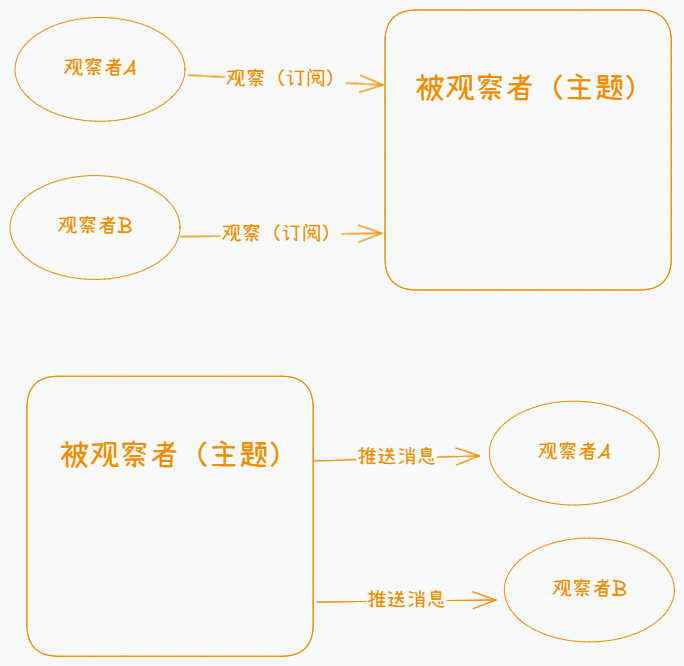

# 前言

今天我们来探讨一下容易令人困惑分不清的发布订阅和观察者模式。

一般认为观察者模式是一种设计模式，而发布订阅则不是。发布订阅可以理解为特定问题的解决方案，或某种实践思想。甚至会有人将发布订阅看作观察者模式的变种实现。

它们的本质都是对某类问题的解决方案，本文不过度纠结于它们的定义，而是将重心放在对它们的思想进行分析理解，并尝试手写代码实现。

# 概念

## 发布订阅

发布订阅可以理解为微信公众号平台，拥有一个中间媒介，它主要提供事件订阅和事件发布这两个重要的功能，从而把订阅者和发布者隔离开。

以微信公众号作为例子：

- 订阅者只需要使用公众号平台的“订阅”功能，告诉平台我需要订阅哪个公众号的文章，而无需直接跟公众号的运营者联系（用户甚至不知道公众号的运营者是谁）
- 当公众号的运营者想要发表文章时，只需要使用公众号平台的“发布”功能，把文章发布上去，平台会自动地把文章推送给所有订阅者。同理，公众号运营者在此过程也无需直接跟订阅者联系。
- 公众号平台则是中间媒介，处理所有事件的订阅和推送。

示意图如下所示：


## 观察者模式

观察者模式则是没有中间媒介，观察者和被观察者直接联系，完成消息订阅和推送。

以如下智能家居作为例子：假设现在有一个温度传感器，它与智能空调和智能窗帘直接连接，当温度过高则通知空调启动，智能窗帘闭合遮阳。温度过低时，操作相反。在这个场景中：

- 被观察者是温度传感器，空调和智能窗帘是观察者。
- 当被观察者需要向观察者传递消息时，是直接联系观察者的，没有第三方对数据进行处理和中转。

示意图如下所示：



# 具体实现

## 发布订阅

上述例子提到了发布订阅像是微信公众号平台，提供两个重要的功能，分别是“订阅”和“推送”。

回到代码上，我们需要一个对象来承担这个角色，然后拥有 on 方法和 emit 方法，分别承担订阅和推送的功能。

其中 on 方法接受如下两个参数：

- eventName：订阅的事件名称
- callback：回调函数，当事件发布时，执行的行为

emit 方法接受一个或以上的参数：

- eventName：本次发布的事件名
- args：可选，多个参数，将作为 callback 函数的参数

本文将使用 class 的方式去创建上述对象，可使用此类去创建不同的“公众号平台”：

```javascript
class EventBus {
  constructor() {
    // 存放订阅的事件名，及其对应的n个回调函数
    this.eventMap = new Map();
  }

  on(eventName, callback) {
    // eventMap中不存在此事件，则新建此事件
    if (!this.eventMap.has(eventName)) {
      this.eventMap.set(eventName, [callback]);
    } else {
      this.eventMap.get(eventName).push(callback);
    }
  }

  emit(eventName, ...args) {
    // 没有此事件，则直接return
    if (!this.eventMap.has(eventName)) return;

    // 获取此事件的回调函数列表
    const arr = this.eventMap.get(eventName);

    // 执行所有回调函数
    arr.forEach((cb) => {
      cb(...args);
    });
  }
}

const bus = new EventBus();
bus.on("event1", (data) => {
  console.log(`订阅者1收到event1消息：${data}`);
});
bus.on("event1", (data) => {
  console.log(`订阅者2收到event1消息：${data}`);
});
// 可订阅不同事件
bus.on("event2", () => {});
// 发布evnet1
bus.emit("event1", "hello world");
```

上述代码已经实现了发布订阅的核心功能了，接下来拓展两个 api 以增强实用性。

once 方法：一次性地订阅某个事件，所订阅的事件发布了一次之后，就取消对其的订阅。

off 方法：取消对某个事件的订阅。

```javascript
class EventBus {
  constructor() {
    this.eventMap = new Map();
  }

  on(eventName, callback) {
    if (!this.eventMap.has(eventName)) {
      // 增加isOnce属性，判断此订阅是否是一次性的
      this.eventMap.set(eventName, [{ callback, isOnce: false }]);
      return;
    }

    this.eventMap.get(eventName).push({ callback, isOnce: false });
  }

  emit(eventName, ...args) {
    if (!this.eventMap.has(eventName)) return;

    const arr = this.eventMap.get(eventName);

    arr.forEach(({ callback }) => {
      callback(...args);
    });

    // 每次发布事件后，需要将一次性的订阅过滤掉
    this.eventMap.set(
      eventName,
      arr.filter(({ isOnce }) => !isOnce)
    );
  }

  // 一次性订阅某个事件，isOnce属性为true
  once(eventName, callback) {
    if (!this.eventMap.has(eventName)) {
      this.eventMap.set(eventName, [{ callback, isOnce: true }]);
      return;
    }

    this.eventMap.get(eventName).push({ callback, isOnce: true });
  }

  // 取消对某个事件的订阅
  off(eventName, fn) {
    if (!this.eventMap.has(eventName)) return;

    const arr = this.eventMap.get(eventName);

    // 判断fn函数的堆内存地址与订阅了的回调函数是否一致
    const index = arr.findIndex(({ callback }) => fn === callback);

    if (index >= 0) {
      arr.splice(index, 1);
    }
  }
}

const bus = new EventBus();
function fn1(data) {
  console.log(`订阅者1收到event1消息：${data}`);
}
function fn2(data) {
  console.log(`订阅者2收到event1消息：${data}`);
}
bus.on("event1", fn1);
bus.on("event1", fn2);
// 发布evnet1
bus.emit("event1", "hello world");
bus.off("event1", fn1);
bus.emit("event1", "hi");
```

## 观察者模式

而观察者模式中，没有中间媒介，被观察者和观察者是直接联系的，这在代码中实现，就需要两个对象，分别代表观察者和被观察者。

其中观察者的任务相对简单，它只需要提供一个 update 方法，此方法会在订阅的事件推送时被调用。

而被观察者则需要承担更重要的任务了，它需要提供订阅功能和事件推送功能，并且在事件推送时，主动调用观察者的 update 方法。

```javascript
// 被观察者
class Subject {
  constructor() {
    // 维护观察者列表
    this.observers = [];
  }

  // 订阅方法
  subscribe(observer) {
    // 现订观察者列表中无此观察者时，将其加入列表
    if (!this.observers.find((item) => item === observer)) {
      this.observers.push(observer);
    }
  }

  // 取消订阅方法
  unsubscribe(observer) {
    this.observers = this.observers.filter((item) => item !== observer);
  }

  // 事件推送方法
  notify(data) {
    // 主动调用所有观察者的update方法
    this.observers.forEach((item) => {
      item.update(data);
    });
  }
}

class Observer {
  constructor(name) {
    // 自定义观察者的信息
    this.name = name;
  }

  // 观察者核心函数，事件推送时，被观察者会主动调用
  update(data) {
    console.log(`${this.name}收到数据：${data}`);
  }
}

const subject1 = new Subject();
const observer1 = new Observer("观察者1");
const observer2 = new Observer("观察者2");
subject1.subscribe(observer1);
subject1.subscribe(observer2);
subjet1.notify("some data");
```

## 总结

发布订阅和观察者模式其实思想比较类似，而在实际开发中会针对业务进行对应的调整，甚至会使用到对方的思想，无需拘泥于所谓的标准实现。

在代码实现中，它们的最大区别可能是在于发布订阅有 emit 方法，需要主动触发事件，而观察者模式则无需主动触发，更着重于如何“应对事件的发生”。

# 实际开发中的体现

发布订阅和观察者模式归根结底都是一种思想，在实际应用中并非死板地套用上述代码，而实践了它们的核心思想的代码设计，都是发布订阅或观察者模式的体现。

以下将会列举实际开发中运用到发布订阅或观察者模式思想的设计方案

## 发布订阅

一、event-emitter

[event-emitter](https://www.npmjs.com/package/event-emitter)是一个库，可以实现应用中的消息传播。

二、Vue2 中的 $on 与 $emit

Vue2 中的 [$on](https://v2.cn.vuejs.org/v2/api/#vm-on) 与 [$emit](https://v2.cn.vuejs.org/v2/api/#vm-emit) 这一对 api 可以监听和触发当前实例上的自定义事件。

在实际开发中，会使用它们作为事件总线，以实现不同组件之间的互相通信。

## 观察者模式

一、事件监听器

如监听 DOM 上某个元素的 click 事件

```javascript
// 被观察者：button按钮
// 观察者：事件处理函数
button.addEventListener("click", function () {
  console.log("按钮被点击了");
});
```

二、Promise

Promise 处理异步操作时，通过监听状态的改变，从而调用 then 函数中的回调，体现的也是观察者模式的思想

```javascript
const promise = new Promise((resolve, reject) => {
  setTimeout(() => resolve("成功"), 1000);
});
// 被观察者：promise对象
// 观察者：then中的回调函数
promise.then((res) => {
  console.log(res);
});
```

# 总结
发布订阅与观察者模式思想相近，在实际使用中也会略有差异，由上述总结的实际使用例子可以大概猜测，观察者模式更多用于处理状态变化或事件的触发而引起的后续操作，而发布订阅可能更多地体现在应用通信中。

在实际项目中，也可尝试根据以下规律选择对应的思想来设计实现方案：
1. 小型项目使用观察者模式，大型项目使用发布订阅。
2. 业务耦合度高使用观察者模式，要解耦合则使用发布订阅。
3. 性能要求高的话选择观察者模式（因其没有中间媒介，减少处理的层级）
